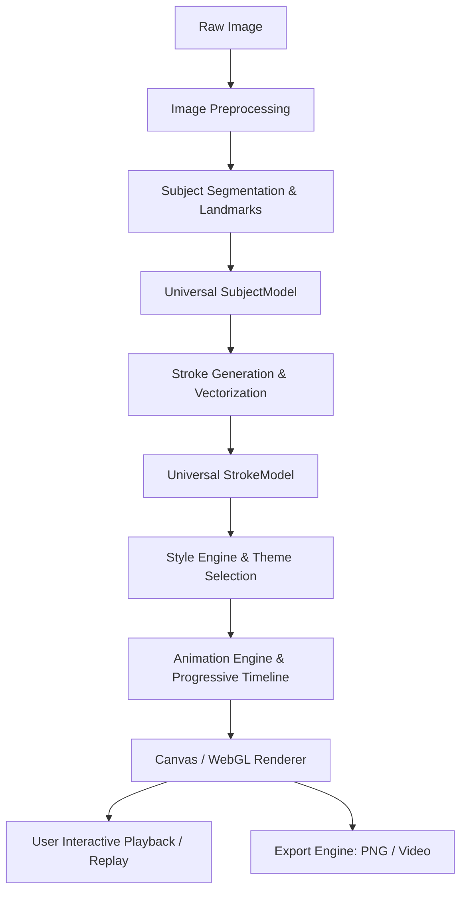

# ARCHITECTURE.md

## Repository State & Actual Architecture

> **Notice:** This document tracks the **actual implementation architecture** of the repository. It is updated continuously as code is introduced.

---

## 1. Current State of Repository
* **Status:** Phase 0 Monorepo Scaffold & Universal Data Contracts Complete.
* **Workspace Directory:** `d:/projects 2.0/main/sketch-maker`
* **File System Contents:**
  * `docs/`: Comprehensive project knowledge system (11 documents).
  * `packages/shared-types`: Universal intermediate representation contracts (`SubjectModel`, `Stroke`, `StyleConfig`, `PipelineProgress`).
  * `packages/image-processing`, `packages/structural-analysis`, `packages/stroke-engine`, `packages/style-engine`, `packages/animation-engine`, `packages/export-engine`: Initialized engine package structures with typecheck scripts.
  * `apps/web`: React 18 + Vite + TypeScript client with dark-mode aesthetic design tokens and alias links to engine packages.
* **Build System:** npm workspaces configured in root `package.json`, TypeScript 5.4+ project reference base via `tsconfig.base.json`.
* **Git Status:** Initialized git repository with comprehensive `.gitignore`. Initial commit `058e8fc`.

---

## 2. Target System Architecture (Blueprint from Project Spec)

The system is architected as an engine-first, multi-package monorepo to guarantee clean separation between algorithms and user interface.

```
photo-to-art (sketch-maker)/
│
├── apps/
│   ├── web/                     # Web Application (React + Vite + TypeScript, Canvas/WebGL)
│   └── mobile/                  # Future React Native App (Phase 11+)
│
├── packages/
│   ├── image-processing/        # Platform-agnostic image transformations, normalization, luminance
│   ├── structural-analysis/    # Platform-agnostic segmentation, landmarks, edge flow analysis
│   ├── stroke-engine/           # Platform-agnostic vector extraction, curve simplification, weighting
│   ├── style-engine/            # Platform-agnostic style generators (Cinematic, Sketch, Neon, etc.)
│   ├── animation-engine/        # Platform-agnostic progressive drawing timeline & math
│   ├── export-engine/           # Headless export encoders & rasterizers
│   └── shared-types/            # Universal models (SubjectModel, Stroke, StyleConfig, etc.)
│
├── tests/
│   ├── images/                  # Standard benchmark image test set
│   ├── structural/              # Unit tests for segmentation & landmark extraction
│   ├── strokes/                 # Unit tests for stroke generation & simplification
│   ├── rendering/               # Visual regression & canvas draw tests
│   └── performance/             # Latency & memory benchmarking scripts
│
└── docs/                        # Persistent project memory system
```

---

## 3. Universal Intermediate Representation (Data Contracts)

The architectural bridge between the deep image analysis phase and the creative rendering phase is the **Universal Intermediate Representation**. This enables caching: analyze once, render in any style repeatedly.

### 3.1 SubjectModel (Universal Structural Representation)
```typescript
export interface Point2D {
  x: number; // Normalized [0, 1] coordinate
  y: number; // Normalized [0, 1] coordinate
}

export interface ContourPath {
  id: string;
  points: Point2D[];
  closed: boolean;
  confidence: number;
}

export interface FacialFeatures {
  leftEye: ContourPath[];
  rightEye: ContourPath[];
  eyebrows: ContourPath[];
  nose: ContourPath[];
  mouth: ContourPath[];
  jawline: ContourPath[];
  ears: ContourPath[];
}

export interface BodyFeatures {
  shoulders: ContourPath[];
  arms: ContourPath[];
  torso: ContourPath[];
  legs: ContourPath[];
  poseConfidence: number;
}

export interface SubjectModel {
  version: string;
  imageDimensions: { width: number; height: number };
  silhouette: ContourPath[];
  subjectMask?: ImageData | Uint8Array; // Alpha mask of foreground subject
  face?: FacialFeatures;
  hair?: ContourPath[];
  body?: BodyFeatures;
  clothing?: ContourPath[];
  accessories?: ContourPath[];
  globalConfidence: number;
  timestamp: number;
}
```

### 3.2 Stroke & StrokeModel
```typescript
export type SemanticRegion = 
  | 'eyes'
  | 'eyebrows'
  | 'nose'
  | 'mouth'
  | 'face_contour'
  | 'hair_boundary'
  | 'body_outline'
  | 'clothing'
  | 'texture'
  | 'background'
  | 'highlight';

export interface StrokePoint extends Point2D {
  pressure?: number;
  widthMultiplier?: number;
}

export interface Stroke {
  id: string;
  startPoint: StrokePoint;
  endPoint: StrokePoint;
  controlPoints: StrokePoint[]; // Quadratic or Cubic Bézier points, or polyline points
  region: SemanticRegion;
  importance: number;           // Normalized [0.0 - 1.0] (e.g. Eyes: 1.0, Texture: 0.25)
  length: number;               // Geometric length in canvas units
  order: number;                // Sequence index in progressive drawing timeline
  styleMetadata?: Record<string, unknown>;
}

export interface StrokeModel {
  subjectModelId: string;
  strokes: Stroke[];
  totalStrokes: number;
  totalLength: number;
  drawingOrder: number[]; // Ordered array of stroke indices
}
```

---

## 4. End-to-End Processing Pipeline



### Stage Responsibilities:
1. **Image Preprocessing:** Aspect ratio handling, color normalization, contrast equalization, resizing to target processing resolution based on profile (`FAST`, `BALANCED`, `HIGH`).
2. **Subject Segmentation & Landmarks:** Foreground extraction, suppression of messy backgrounds, landmark extraction for facial and bodily features.
3. **Universal SubjectModel:** Headless structural tree containing weighted contours.
4. **Stroke Engine:** Converts contours into simplified, smooth vector paths with semantic importance tags.
5. **Universal StrokeModel:** Cached stroke geometry ready for styling.
6. **Style Engine:** Applies artistic shaders/brushes (Cinematic, Sketch, Neon, Blueprint, Binary, Terminal, Red Line).
7. **Animation Engine:** Controls drawing progression, reveal timing, particle/glow transitions, and easing curves.
8. **Rendering:** Dual mode (Interactive Canvas 2D / WebGL for real-time progressive playback; high-res headless offscreen canvas for final output).
9. **Export:** Encodes raster frames into WebM/MP4 video or high-res lossless PNG.

---

## 5. Technology Stack Selection Criteria

| Layer | Initial Technology | Rationale |
| :--- | :--- | :--- |
| **Monorepo / Workspace** | npm / pnpm workspaces | Native node workspace support, zero bloat, isolates packages |
| **Web UI** | React + Vite + TypeScript | Lightning-fast HMR, clean client-side Canvas rendering, optimal Vercel static deployment, zero SSR complexity |
| **Core Processing** | Pure TypeScript / WebAssembly where needed | Maximum platform portability (Web + React Native) |
| **Rendering** | HTML5 Canvas 2D / WebGL | Hardware accelerated, zero external runtime dependency, universal support |
| **Styling** | Vanilla CSS / CSS Modules | Clean design system tokens, optimal performance, zero CSS-in-JS overhead |
| **Testing** | Vitest + Playwright | Rapid headless unit testing for geometry + visual browser tests |

---

---

## 6. Development & Verification Environment
* **Platform:** Windows 10/11 x64, Node.js runtime, PowerShell terminal.
* **Target Host:** Vercel serverless / static asset hosting.

---

## 7. Vision Provider Architecture (TASK-103.6)

Following the evaluation in `docs/VISION_BACKEND_EVALUATION.md` and `ADR-010`, perception is abstracted through a decoupled provider boundary. Downstream procedural art engines depend strictly on the Universal Intermediate Representation (`SubjectModel`) and never communicate directly with computer vision algorithms or neural network libraries.

### 7.1 Architectural Overview

```text
                    INPUT IMAGE (NormalizedImage)
                                 │
                                 ▼
                         VisionCoordinator
                                 │
              ┌──────────────────┴──────────────────┐
              │                                     │
              ▼                                     ▼
   DeterministicVisionProvider             MediaPipeVisionProvider
   (Pure TypeScript, 0-dep)                (Optional ML runtime)
              │                                     │
              └──────────────────┬──────────────────┘
                                 ▼
                     Evidence-Aware Reconciliation
                     (Hybrid Merge / Fallback)
                                 │
                                 ▼
                           VisionResult
                                 │
                     ┌───────────┴───────────┐
                     ▼                       ▼
               SubjectModel          VisionExecutionPlan
                     │                 (Audit & Metadata)
                     ▼
          Procedural Art Engine
          (Stroke & Style Pipelines)
```

### 7.2 Core Contracts (`packages/structural-analysis/src/providers/types.ts`)

* **`VisionProvider`**: Minimal asynchronous perception contract:
  ```typescript
  export interface VisionProvider {
    readonly metadata: VisionProviderMetadata;
    isAvailable(): boolean;
    analyze(input: VisionInput): Promise<VisionResult>;
  }
  ```
* **`VisionInput`**: Preprocessed image luminance buffer (`NormalizedImage`), original image dimensions, and optional execution options.
* **`VisionResult`**: Contains `primarySubject: SubjectModel`, `allSubjects: SubjectModel[]`, `scale`, processing `metrics` (latencies, counts), provider `metadata`, and an execution audit trail `plan`.
* **`VisionCoordinator`**: High-level orchestrator supporting execution modes:
  * `'deterministic'`: Guarantees 100% pure TypeScript execution with zero external network requests.
  * `'ml'`: Uses pretrained ML models (throws structured error if unavailable).
  * `'auto'`: Attempts ML acceleration; falls back automatically and seamlessly to deterministic execution if ML is unavailable or fails.
  * `'hybrid'`: Concurrently executes both pipelines and merges dense ML facial landmarks with deterministic ear pinna geometry and silhouette-anchored hair contours.

### 7.3 Evidence-Aware Hybrid Reconciliation

Pretrained neural networks (like MediaPipe FaceLandmarker) provide dense 468-point meshes but lack external ear pinna geometry and produce over-smoothed silhouette hair boundaries. The hybrid merge layer enforces the following reconciliation rules:
1. **Internal Facial Features:** Dense eye contours, lip contours, and nasal landmarks are accepted from the ML provider when confidence exceeds 0.50.
2. **Ear Pinna Preservation:** External helix and lobule contours from `DeterministicVisionProvider` are strictly preserved into the final `SubjectModel`, preventing ear omission in art rendering.
3. **Silhouette & Hair Contours:** Gradient edge-aligned hair and silhouette paths from deterministic analysis are preserved alongside ML facial landmarks.
4. **Visibility Semantics:** Occlusion classifications (`'occluded'`, `'uncertain'`, `'visible'`, `'not_detected'`) are strictly preserved across both backends.

### 7.4 Web vs. Mobile Separation

* **Platform Neutrality:** Core packages (`@sketch-maker/structural-analysis`, `@sketch-maker/shared-types`) contain no browser-only (`window`, `document`) or Node-only APIs.
* **Web Runtime:** In the web client (`apps/web`), `MediaPipeVisionProvider` is instantiated with `MediaPipeWebDelegate` from `apps/web/src/vision/mediapipe/`.
* **Mobile Runtime:** In a future React Native client (`apps/mobile`), the same provider interface accepts native iOS/Android bridge delegates.
* **Headless CI / Testing:** Automated test suites run in pure Node.js using `DeterministicVisionProvider` without WebGL or canvas polyfills.

### 7.5 MediaPipe Face Landmarker Web Integration (TASK-103.7)

* **Isolated Bundle Chunk:** MediaPipe tasks are isolated in a lazy-loaded Vite chunk (`vision_bundle-*.js`), keeping the initial application bundle lightweight (~172 kB).
* **478-Landmark Mapping:** Maps dense 3D points to canonical `SubjectModel` features (iris centers, palpebral fissures, nasal apex, lips, mandibular contour) while clamping all normalized coordinates to `[0.0, 1.0]`.
* **Profile Occlusion Enforcement (`BM-02`):** MediaPipe's complete face projections are audited against derived head pose; features on the hidden side of true profiles are tagged `'occluded'` with 0 confidence to prevent hallucination.
* **Zero Ear Fabrication:** MediaPipe's lack of pinna geometry is respected; ears are left undefined or sourced authoritatively from the deterministic pipeline via the `reconcileHybridSubjects` reconciler.

### 7.6 MediaPipe Pose Landmarker Web Integration (TASK-103.8)

* **Shared WASM Fileset:** `MediaPipeWebDelegate` manages a single, shared `FilesetResolver` that on-demand instantiates `FaceLandmarker` (3.7 MB) and `PoseLandmarker` (5.6 MB), avoiding redundant WASM initialization and unnecessary model downloads.
* **33-Point Skeletal Body Representation:** Canonical `BodyPose` data contracts in `@sketch-maker/shared-types` represent articulated landmarks (`point`, `z`, `visibility`, `presence`, `confidence`), synthesized neck midpoint, and skeletal connection links.
* **Posture Robustness:** Accurately distinguishes standing (`BM-09`) and seated flexed postures (`BM-10`) without imposing rigid vertical priors.
* **Face + Pose Spatial Association:** The `associateFacesAndPoses` engine matches detected facial meshes with corresponding body skeletons using head-anchor proximity, producing unified multi-person instances (`BM-11`) while preserving single-person cohesion.

### 7.7 MediaPipe Image Segmenter Web Integration (TASK-103.9)

* **Shared WASM Fileset & Lazy Model Loading:** `MediaPipeWebDelegate` extends the existing shared `FilesetResolver` to lazily instantiate `ImageSegmenter` using `selfie_multiclass_256x256.tflite` (16.37 MB) only when semantic segmentation is requested.
* **6-Class Semantic Representation:** Discrete model outputs (`0: background`, `1: hair`, `2: body-skin`, `3: face-skin`, `4: clothes`, `5: others`) map cleanly to canonical `SemanticCategory` and `SemanticSegmentation` data contracts in `@sketch-maker/shared-types`.
* **Nearest-Neighbor Category Resampling & Bilinear Confidence Interpolation:** Discrete category index masks are resampled strictly via nearest-neighbor to prevent invalid synthetic category indices, while continuous confidence maps use bilinear interpolation to generate smooth, anti-aliased probabilities $[0.0, 1.0]$.
* **Evidence-Aware Mask Reconciliation:** Blends ML semantic classification with deterministic luminance/Sobel edge segmentation. The consensus core is retained, ML semantic classification overrides deterministic false positives in complex backgrounds (`BM-07`) and deep chiaroscuro shadows (`BM-06`), while high-gradient Sobel edge barriers from deterministic analysis are preserved to maintain sharp, hairline/contour boundaries (`BM-05`).
* **Semantic vs. Instance Disambiguation:** MediaPipe multiclass is class-level semantic segmentation (no instance separation). The architecture preserves deterministic connected-component clustering (`instances: SubjectRegion[]`) for multi-subject isolation (`BM-11`).

---

## 8. Contour & Vector Generation Architecture (TASK-104)

### 8.1 Architectural Role & Boundaries
The Vector Generation engine lives inside `@sketch-maker/stroke-engine/geometry` and consumes the perception IR (`SubjectModel`, facial landmarks, body pose skeleton, semantic masks, silhouette, hair) to generate the resolution-independent vector geometry intermediate representation (`VectorGeometry`).

```text
SubjectModel (Perception IR)
          │
          ▼
packages/stroke-engine/src/geometry/
  ├── cleaning.ts           (clamping, NaN sanitization, deduplication, spike & collinear filtering)
  ├── simplification.ts     (adaptive Ramer-Douglas-Peucker reduction per hierarchy level)
  ├── curves.ts             (cubic Catmull-Rom Bézier spline fitting with overshoot clamp)
  ├── mask-contours.ts      (Moore-neighborhood boundary tracing for raster semantic masks)
  ├── importance.ts         (multi-cue deterministic importance formula)
  └── extractor.ts          (unified VectorGeometry extraction orchestrator)
          │
          ▼
VectorGeometry (Canonical Resolution-Independent Geometry IR)
```

* **Zero Browser/DOM Dependencies:** Core packages (`packages/shared-types`, `packages/stroke-engine`) contain zero references to `window`, `document`, HTMLCanvasElement, CanvasRenderingContext2D, or SVG DOM elements.
* **Preservation of Raw Perception Evidence:** Input points are preserved unmodified in `rawPoints: Point2D[]`. Simplification produces `points: Point2D[]` and `curves: BezierCurve[]` without destroying original perceptual confidence or coordinates.
* **Strict Separation from Rendering:** Vector generation extracts geometric polylines and curves. Stroke animation, draw ordering, brush dynamics, and canvas rendering belong exclusively to downstream tasks (TASK-105+).

### 8.2 Canonical Vector Data Contracts (`@sketch-maker/shared-types`)
* **`VectorPath`:** Encapsulates an individual geometric curve with metadata:
  * `source`: `'face_landmark' | 'jawline' | 'ear' | 'hair' | 'pose_connection' | 'semantic_mask' | 'silhouette' | 'fallback_edge'`
  * `level`: `'primary_structural' | 'secondary_expressive' | 'anatomical_gesture' | 'boundary_contour' | 'tertiary_texture'`
  * `subjectId`: Unique string ensuring multi-person separation (`BM-11`)
  * `featureName`: Descriptive identifier (`'left_eyelid_upper'`, `'jawline_visible'`, etc.)
  * `points`: Clean, RDP-simplified polyline points in $[0.0, 1.0]$ space
  * `rawPoints`: Original perception points for forensic audit / reconstruction
  * `curves`: Fitted cubic Bézier curve segments
  * `isClosed`: Topological closure boolean
  * `confidence`: Perception detector confidence $[0.0, 1.0]$
  * `visibility`: Occlusion status (`'visible' | 'uncertain' | 'occluded' | 'not_detected'`)
  * `importance`: Deterministic sorting score $[0.0, 1.0]$
  * `bounds`: Axis-aligned bounding box $[0.0, 1.0]$
  * `arcLength`: Cumulative normalized curve length
* **`GeometryMetrics`:** Aggregates `totalPaths`, `totalRawPoints`, `totalSimplifiedPoints`, `reductionPercentage`, and `extractionLatencyMs`.
* **`VectorGeometry`:** Container holding `paths: VectorPath[]`, aggregate `bounds`, and `metrics`.

### 8.3 Geometric Simplification & Curve Fitting
* **Cleaning:** Coordinates clamped to $[0.0, 1.0]$, NaNs rejected, duplicate vertices ($\epsilon = 10^{-5}$) filtered, isolated acute spikes ($d > 0.35$) pruned, and redundant collinear vertices (area $< 10^{-7}$) collapsed.
* **RDP Tolerances:** Calibrated per hierarchy level:
  * `primary_structural`: $\epsilon = 0.0015$
  * `secondary_expressive`: $\epsilon = 0.0025$
  * `anatomical_gesture`: $\epsilon = 0.0035$
  * `boundary_contour`: $\epsilon = 0.0040$
  * `tertiary_texture`: $\epsilon = 0.0050$
* **Bézier Fitting:** Catmull-Rom tangents with chord-length weighting, endpoint clamping to prevent overshoot ($\|C - P\| \le 0.4 \times L$), and continuous tangent wrapping on closed loops.
* **Mask Boundary Extraction:** Clockwise Moore-neighborhood tracing with configurable grid step (default: 4px) and minimum area threshold ($0.001$).
* **Importance Scoring:** $I = 0.45 \times w_{\text{semantic}} + 0.25 \times c + 0.15 \times v + 0.15 \times s$, ranking primary facial features above secondary clothing boundaries.

---

## 9. Procedural Stroke Candidate Generation Architecture (TASK-105)

### 9.1 Architectural Transition: Geometry to Stroke Candidates
TASK-105 establishes the boundary between static vector geometry (`VectorGeometry`) and procedural drawing actions (`StrokeCandidate[]`).

```text
VectorGeometry (Canonical Geometry IR)
          │
          ▼
packages/stroke-engine/src/candidates/
  ├── semantic-roles.ts     (role mapping: eye, eyebrow, nose, mouth, ear, silhouette, hair, pose, clothing)
  ├── partitioning.ts       (gesture subdivision: angular turn detection + length partitioning)
  ├── properties.ts         (deterministic width, density, and priority modeling)
  ├── filtering.ts          (eligibility, occlusion, confidence, and length gates)
  ├── validator.ts          (numerical sanitization and finite bounds check)
  └── generator.ts          (unified candidate generation pipeline)
          │
          ▼
StrokeCandidateSet (Procedural Stroke Candidate IR)
```

* **Stroke vs. Path Distinction:** A single `VectorPath` represents mathematical geometric evidence. In contrast, a `StrokeCandidate` represents a potential human-like drawing action. A path may yield 0 strokes (occluded/noise), 1 stroke (focal facial feature), or multiple strokes (long silhouette segmented into gesture arcs).
* **Zero Browser/DOM Dependencies:** Core packages (`packages/shared-types`, `packages/stroke-engine`) contain zero references to `window`, `document`, HTMLCanvasElement, CanvasRenderingContext2D, or SVG DOM elements.
* **Separation from Progressive Animation:** Stroke candidates define drawability, width, and relative priority. Final global timeline scheduling, frame progression, canvas rendering, and export belong exclusively to subsequent tasks (TASK-106+).

### 9.2 Canonical Stroke Candidate Contract (`@sketch-maker/shared-types`)
* **`StrokeCandidate`:**
  * `id`: Unique candidate identifier (e.g. `subject_0_face_left_eye_upper_stroke_0`)
  * `subjectId`: Preserves multi-person instance separation (`BM-11`)
  * `sourcePathId`: Origin path ID for non-destructive traceability
  * `source`: Provenance (`'face_contour' | 'silhouette' | 'pose_connection' | ...`)
  * `points`: Simplified polyline coordinates in $[0.0, 1.0]$ space
  * `curves`: Preserved/fitted cubic Bézier splines
  * `closed`: Topological closure boolean
  * `confidence`: Detector confidence $[0.0, 1.0]$
  * `importance`: Refined stroke-level importance $[0.0, 1.0]$
  * `priorityScore`: Scheduling priority $[0.0, 1.0]$
  * `semanticRole`: High-level role (`'eye' | 'eyebrow' | 'nose' | 'mouth' | 'ear' | 'silhouette' | 'hair' | 'body_structure' | 'clothing_boundary' | 'detail' | 'texture' | 'background'`)
  * `hierarchyLevel`: Path structural hierarchy (`0 | 1 | 2 | 3 | 4`)
  * `width`: Line weight multiplier calibrated by anatomical prominence
  * `density`: Detail allocation density $[0.0, 1.0]$
  * `length`: Normalized geometric arc length
  * `bounds`: Axis-aligned bounding box $[0.0, 1.0]$
  * `visibility`: Occlusion status (`'visible' | 'occluded' | 'not_detected' | 'uncertain'`)
  * `drawable`: Eligibility flag indicating qualification for drawing
  * `isBackground`: Boolean distinguishing background from subject
  * `filteredReason`: Reason when non-drawable (`'occluded' | 'low_confidence' | 'too_short' | 'background' | ...`)
* **`StrokeMetrics`:** Aggregates `totalCandidates`, `drawableCandidates`, `filteredCandidates`, `totalLength`, `averageLength`, `averageConfidence`, `averageImportance`, `averageWidth`, `strokesBySemanticRole`, `strokesByHierarchy`, `strokesBySubject`, and `generationLatencyMs`.
* **`StrokeCandidateSet`:** Top-level container holding `candidates: StrokeCandidate[]`, `bounds: BoundingBox`, `metrics: StrokeMetrics`, and metadata.

### 9.3 Physical & Artistic Models
* **Gesture Path Partitioning:** Protected facial features (`eyes`, `eyebrows`, `nose`, `mouth`, `ears`) are never fragmented. Long silhouettes or boundaries are split at sharp corners ($\theta > 75^\circ$) or arc length increments ($\le 0.35$).
* **Expressive Line Weight:** Modulated by role and hierarchy:
  $$w = w_{\text{base}} \times (0.8 + 0.2 \cdot c) \times (0.85 + 0.15 \cdot I)$$
* **Detail Density:** Calibrated per region (eyes/nose/mouth: $1.0$, ears/jawline: $0.85$, hair: $0.80$, silhouette: $0.75$, pose: $0.70$, clothing: $0.60$, background: $0.20$).
* **Drawing Priority Score:**
  $$P = 0.40 \cdot I + 0.30 \cdot w_{\text{role}} + 0.20 \cdot c + 0.10 \cdot \min(1.0, 2L)$$
* **Profile Occlusion Guarantee:** Features with `visibility === 'occluded'` strictly produce `drawable: false, filteredReason: 'occluded'`, yielding zero visible lines on the hidden side of true profiles (`BM-02`).

---

## 10. Stroke Ordering & Composition Architecture (TASK-106)

TASK-106 establishes the boundary between unordered procedural stroke candidates (`StrokeCandidate[]`) and a deterministic, artistically coherent progressive drawing sequence (`OrderedStrokeSequence`).

```text
StrokeCandidate[] (Unordered Candidates from TASK-105)
          │
          ▼
packages/stroke-engine/src/ordering/
  ├── phases.ts             (6-phase composition mapping: foundation -> primary -> features -> anatomy -> refinement -> texture)
  ├── dependencies.ts       (structural dependency hierarchy: parents/children, depth calculation)
  ├── comparator.ts         (deterministic multi-factor comparator: phase, subject, depth, role, spatial, importance)
  ├── sorter.ts             (partitioning drawable vs filtered, sorting, sequential 0-based indexing)
  ├── validator.ts          (strict sequence integrity, occlusion exclusion, subject preservation, geometry immutability)
  └── index.ts              (unified ordering entry point)
          │
          ▼
OrderedStrokeSequence (Canonical Ordered Sequence IR)
  ├── orderedStrokes: OrderedStroke[] (drawable strokes in progressive execution order)
  ├── filteredStrokes: OrderedStroke[] (occluded/low-confidence strokes excluded from canvas)
  └── metrics: StrokeOrderingMetrics (phase distribution, dependency stats, latency)
```

### 10.1 Six-Phase Composition Model
Artists draw macro-to-micro, establishing silhouette and structural anchors before rendering focal facial details and fine textures:
1. **`foundation` (Phase 0):** Outer silhouette, body gesture/pose anchors, macro envelope (`hierarchyLevel === 0` or role `silhouette` / `body_structure`).
2. **`primary_structure` (Phase 1):** Head contour, jawline, neck, primary anatomical frame (`hierarchyLevel === 1`).
3. **`expressive_features` (Phase 2):** Primary focal focal features (`eyes`, `eyebrows`, `nose`, `mouth`, `pupil/iris`).
4. **`secondary_anatomy` (Phase 3):** External ears, facial contours, secondary anatomical boundaries (`ears`, `face_contour`).
5. **`refinement` (Phase 4):** Hair masses, clothing boundaries, structural subdivisions (`hair`, `clothing_boundary`).
6. **`texture_accent` (Phase 5):** Hatching, surface detail, background accents, atmospheric lines (`detail`, `texture`, `background`).

### 10.2 Structural Dependency Hierarchy
Strokes have natural anatomical dependencies:
* Features (eyes, nose, mouth) depend on the head/jawline.
* Iris/pupil features depend on eye contours.
* Secondary anatomy (ears) depends on head/jawline contours.
* Hair strands depend on the outer head contour.
* Clothing boundaries depend on body pose anchors.

The dependency engine computes directed dependency graphs (`dependencies.ts`) to assign a `dependencyLevel` (0 = root/anchor, 1 = direct child, 2 = nested feature). A child stroke is strictly prevented from appearing earlier than its structural parent.

### 10.3 Multi-Factor Deterministic Comparator
To guarantee 100% reproducible ordering with zero randomness, the comparator evaluates:
1. **Composition Phase:** Natural drawing progression (0 to 5).
2. **Subject Progression:** Harmonized phase interleaving across subjects (`BM-11`), ensuring all subjects emerge synchronously through phases.
3. **Dependency Level:** Parents drawn before children ($L_0 \to L_1 \to L_2$).
4. **Semantic Role Precedence:** Fine-grained role hierarchy within phases (e.g. eyebrows $\to$ eye contours $\to$ irises $\to$ nose bridge $\to$ lips).
5. **Spatial Flow:** Deterministic top-to-bottom ($y$-coordinate) and center-outward flow mirroring natural hand movement.
6. **Importance & Priority:** Higher salience features precede auxiliary strokes.
7. **Arc Length:** Longer anchor gestures precede short accents.
8. **Tie-Breaker:** Origin `sourcePathId` followed by lexicographical candidate `id`.

### 10.4 Canonical Ordered Sequence Contract (`@sketch-maker/shared-types`)
* **`OrderedStroke`:** Non-mutating wrapper preserving full `StrokeCandidate` reference alongside:
  * `sequenceIndex`: Global 0-based drawing order.
  * `phase`: Assigned `CompositionPhase`.
  * `phaseIndex`: Contiguous 0-based index within the phase.
  * `phaseName`: Human-readable phase description.
  * `dependencyLevel`: Structural dependency depth ($0, 1, 2$).
  * `orderingReason`: Deterministic explanation for inspection and auditing.
* **`StrokeOrderingMetrics`:** Tracks total strokes, drawable vs filtered, counts per phase, dependency edge counts, max depth, and ordering latency ($< 2\text{ ms}$).
* **`OrderedStrokeSequence`:** Complete ordered sequence ready for animation timeline scheduling (TASK-107+).
