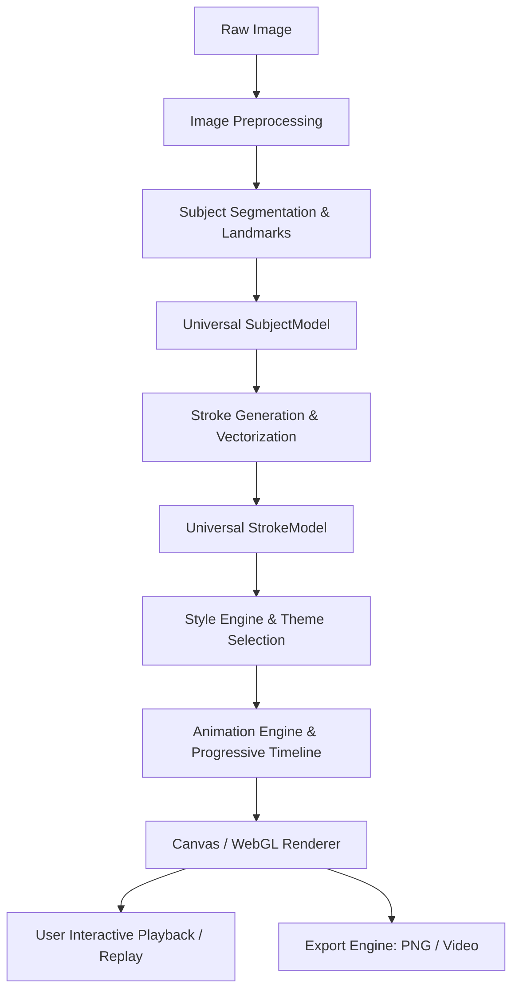

# ARCHITECTURE.md

## Repository State & Actual Architecture

> **Notice:** This document tracks the **actual implementation architecture** of the repository. It is updated continuously as code is introduced.

---

## 1. Current State of Repository
* **Status:** Phase 0 Monorepo Scaffold & Universal Data Contracts Complete.
* **Workspace Directory:** `d:/projects 2.0/main/sketch-maker`
* **File System Contents:**
  * `docs/`: Comprehensive project knowledge system (11 documents).
  * `packages/shared-types`: Universal intermediate representation contracts (`SubjectModel`, `Stroke`, `StyleConfig`, `PipelineProgress`).
  * `packages/image-processing`, `packages/structural-analysis`, `packages/stroke-engine`, `packages/style-engine`, `packages/animation-engine`, `packages/export-engine`: Initialized engine package structures with typecheck scripts.
  * `apps/web`: React 18 + Vite + TypeScript client with dark-mode aesthetic design tokens and alias links to engine packages.
* **Build System:** npm workspaces configured in root `package.json`, TypeScript 5.4+ project reference base via `tsconfig.base.json`.
* **Git Status:** Initialized git repository with comprehensive `.gitignore`. Initial commit `058e8fc`.

---

## 2. Target System Architecture (Blueprint from Project Spec)

The system is architected as an engine-first, multi-package monorepo to guarantee clean separation between algorithms and user interface.

```
photo-to-art (sketch-maker)/
│
├── apps/
│   ├── web/                     # Web Application (React + Vite + TypeScript, Canvas/WebGL)
│   └── mobile/                  # Future React Native App (Phase 11+)
│
├── packages/
│   ├── image-processing/        # Platform-agnostic image transformations, normalization, luminance
│   ├── structural-analysis/    # Platform-agnostic segmentation, landmarks, edge flow analysis
│   ├── stroke-engine/           # Platform-agnostic vector extraction, curve simplification, weighting
│   ├── style-engine/            # Platform-agnostic style generators (Cinematic, Sketch, Neon, etc.)
│   ├── animation-engine/        # Platform-agnostic progressive drawing timeline & math
│   ├── export-engine/           # Headless export encoders & rasterizers
│   └── shared-types/            # Universal models (SubjectModel, Stroke, StyleConfig, etc.)
│
├── tests/
│   ├── images/                  # Standard benchmark image test set
│   ├── structural/              # Unit tests for segmentation & landmark extraction
│   ├── strokes/                 # Unit tests for stroke generation & simplification
│   ├── rendering/               # Visual regression & canvas draw tests
│   └── performance/             # Latency & memory benchmarking scripts
│
└── docs/                        # Persistent project memory system
```

---

## 3. Universal Intermediate Representation (Data Contracts)

The architectural bridge between the deep image analysis phase and the creative rendering phase is the **Universal Intermediate Representation**. This enables caching: analyze once, render in any style repeatedly.

### 3.1 SubjectModel (Universal Structural Representation)
```typescript
export interface Point2D {
  x: number; // Normalized [0, 1] coordinate
  y: number; // Normalized [0, 1] coordinate
}

export interface ContourPath {
  id: string;
  points: Point2D[];
  closed: boolean;
  confidence: number;
}

export interface FacialFeatures {
  leftEye: ContourPath[];
  rightEye: ContourPath[];
  eyebrows: ContourPath[];
  nose: ContourPath[];
  mouth: ContourPath[];
  jawline: ContourPath[];
  ears: ContourPath[];
}

export interface BodyFeatures {
  shoulders: ContourPath[];
  arms: ContourPath[];
  torso: ContourPath[];
  legs: ContourPath[];
  poseConfidence: number;
}

export interface SubjectModel {
  version: string;
  imageDimensions: { width: number; height: number };
  silhouette: ContourPath[];
  subjectMask?: ImageData | Uint8Array; // Alpha mask of foreground subject
  face?: FacialFeatures;
  hair?: ContourPath[];
  body?: BodyFeatures;
  clothing?: ContourPath[];
  accessories?: ContourPath[];
  globalConfidence: number;
  timestamp: number;
}
```

### 3.2 Stroke & StrokeModel
```typescript
export type SemanticRegion = 
  | 'eyes'
  | 'eyebrows'
  | 'nose'
  | 'mouth'
  | 'face_contour'
  | 'hair_boundary'
  | 'body_outline'
  | 'clothing'
  | 'texture'
  | 'background'
  | 'highlight';

export interface StrokePoint extends Point2D {
  pressure?: number;
  widthMultiplier?: number;
}

export interface Stroke {
  id: string;
  startPoint: StrokePoint;
  endPoint: StrokePoint;
  controlPoints: StrokePoint[]; // Quadratic or Cubic Bézier points, or polyline points
  region: SemanticRegion;
  importance: number;           // Normalized [0.0 - 1.0] (e.g. Eyes: 1.0, Texture: 0.25)
  length: number;               // Geometric length in canvas units
  order: number;                // Sequence index in progressive drawing timeline
  styleMetadata?: Record<string, unknown>;
}

export interface StrokeModel {
  subjectModelId: string;
  strokes: Stroke[];
  totalStrokes: number;
  totalLength: number;
  drawingOrder: number[]; // Ordered array of stroke indices
}
```

---

## 4. End-to-End Processing Pipeline



### Stage Responsibilities:
1. **Image Preprocessing:** Aspect ratio handling, color normalization, contrast equalization, resizing to target processing resolution based on profile (`FAST`, `BALANCED`, `HIGH`).
2. **Subject Segmentation & Landmarks:** Foreground extraction, suppression of messy backgrounds, landmark extraction for facial and bodily features.
3. **Universal SubjectModel:** Headless structural tree containing weighted contours.
4. **Stroke Engine:** Converts contours into simplified, smooth vector paths with semantic importance tags.
5. **Universal StrokeModel:** Cached stroke geometry ready for styling.
6. **Style Engine:** Applies artistic shaders/brushes (Cinematic, Sketch, Neon, Blueprint, Binary, Terminal, Red Line).
7. **Animation Engine:** Controls drawing progression, reveal timing, particle/glow transitions, and easing curves.
8. **Rendering:** Dual mode (Interactive Canvas 2D / WebGL for real-time progressive playback; high-res headless offscreen canvas for final output).
9. **Export:** Encodes raster frames into WebM/MP4 video or high-res lossless PNG.

---

## 5. Technology Stack Selection Criteria

| Layer | Initial Technology | Rationale |
| :--- | :--- | :--- |
| **Monorepo / Workspace** | npm / pnpm workspaces | Native node workspace support, zero bloat, isolates packages |
| **Web UI** | React + Vite + TypeScript | Lightning-fast HMR, clean client-side Canvas rendering, optimal Vercel static deployment, zero SSR complexity |
| **Core Processing** | Pure TypeScript / WebAssembly where needed | Maximum platform portability (Web + React Native) |
| **Rendering** | HTML5 Canvas 2D / WebGL | Hardware accelerated, zero external runtime dependency, universal support |
| **Styling** | Vanilla CSS / CSS Modules | Clean design system tokens, optimal performance, zero CSS-in-JS overhead |
| **Testing** | Vitest + Playwright | Rapid headless unit testing for geometry + visual browser tests |

---

---

## 6. Development & Verification Environment
* **Platform:** Windows 10/11 x64, Node.js runtime, PowerShell terminal.
* **Target Host:** Vercel serverless / static asset hosting.

---

## 7. Vision Provider Architecture (TASK-103.6)

Following the evaluation in `docs/VISION_BACKEND_EVALUATION.md` and `ADR-010`, perception is abstracted through a decoupled provider boundary. Downstream procedural art engines depend strictly on the Universal Intermediate Representation (`SubjectModel`) and never communicate directly with computer vision algorithms or neural network libraries.

### 7.1 Architectural Overview

```text
                    INPUT IMAGE (NormalizedImage)
                                 │
                                 ▼
                         VisionCoordinator
                                 │
              ┌──────────────────┴──────────────────┐
              │                                     │
              ▼                                     ▼
   DeterministicVisionProvider             MediaPipeVisionProvider
   (Pure TypeScript, 0-dep)                (Optional ML runtime)
              │                                     │
              └──────────────────┬──────────────────┘
                                 ▼
                     Evidence-Aware Reconciliation
                     (Hybrid Merge / Fallback)
                                 │
                                 ▼
                           VisionResult
                                 │
                     ┌───────────┴───────────┐
                     ▼                       ▼
               SubjectModel          VisionExecutionPlan
                     │                 (Audit & Metadata)
                     ▼
          Procedural Art Engine
          (Stroke & Style Pipelines)
```

### 7.2 Core Contracts (`packages/structural-analysis/src/providers/types.ts`)

* **`VisionProvider`**: Minimal asynchronous perception contract:
  ```typescript
  export interface VisionProvider {
    readonly metadata: VisionProviderMetadata;
    isAvailable(): boolean;
    analyze(input: VisionInput): Promise<VisionResult>;
  }
  ```
* **`VisionInput`**: Preprocessed image luminance buffer (`NormalizedImage`), original image dimensions, and optional execution options.
* **`VisionResult`**: Contains `primarySubject: SubjectModel`, `allSubjects: SubjectModel[]`, `scale`, processing `metrics` (latencies, counts), provider `metadata`, and an execution audit trail `plan`.
* **`VisionCoordinator`**: High-level orchestrator supporting execution modes:
  * `'deterministic'`: Guarantees 100% pure TypeScript execution with zero external network requests.
  * `'ml'`: Uses pretrained ML models (throws structured error if unavailable).
  * `'auto'`: Attempts ML acceleration; falls back automatically and seamlessly to deterministic execution if ML is unavailable or fails.
  * `'hybrid'`: Concurrently executes both pipelines and merges dense ML facial landmarks with deterministic ear pinna geometry and silhouette-anchored hair contours.

### 7.3 Evidence-Aware Hybrid Reconciliation

Pretrained neural networks (like MediaPipe FaceLandmarker) provide dense 468-point meshes but lack external ear pinna geometry and produce over-smoothed silhouette hair boundaries. The hybrid merge layer enforces the following reconciliation rules:
1. **Internal Facial Features:** Dense eye contours, lip contours, and nasal landmarks are accepted from the ML provider when confidence exceeds 0.50.
2. **Ear Pinna Preservation:** External helix and lobule contours from `DeterministicVisionProvider` are strictly preserved into the final `SubjectModel`, preventing ear omission in art rendering.
3. **Silhouette & Hair Contours:** Gradient edge-aligned hair and silhouette paths from deterministic analysis are preserved alongside ML facial landmarks.
4. **Visibility Semantics:** Occlusion classifications (`'occluded'`, `'uncertain'`, `'visible'`, `'not_detected'`) are strictly preserved across both backends.

### 7.4 Web vs. Mobile Separation

* **Platform Neutrality:** Core packages (`@sketch-maker/structural-analysis`, `@sketch-maker/shared-types`) contain no browser-only (`window`, `document`) or Node-only APIs.
* **Web Runtime:** In the web client (`apps/web`), `MediaPipeVisionProvider` is instantiated with `MediaPipeWebDelegate` from `apps/web/src/vision/mediapipe/`.
* **Mobile Runtime:** In a future React Native client (`apps/mobile`), the same provider interface accepts native iOS/Android bridge delegates.
* **Headless CI / Testing:** Automated test suites run in pure Node.js using `DeterministicVisionProvider` without WebGL or canvas polyfills.

### 7.5 MediaPipe Face Landmarker Web Integration (TASK-103.7)

* **Isolated Bundle Chunk:** MediaPipe tasks are isolated in a lazy-loaded Vite chunk (`vision_bundle-*.js`), keeping the initial application bundle lightweight (~172 kB).
* **478-Landmark Mapping:** Maps dense 3D points to canonical `SubjectModel` features (iris centers, palpebral fissures, nasal apex, lips, mandibular contour) while clamping all normalized coordinates to `[0.0, 1.0]`.
* **Profile Occlusion Enforcement (`BM-02`):** MediaPipe's complete face projections are audited against derived head pose; features on the hidden side of true profiles are tagged `'occluded'` with 0 confidence to prevent hallucination.
* **Zero Ear Fabrication:** MediaPipe's lack of pinna geometry is respected; ears are left undefined or sourced authoritatively from the deterministic pipeline via the `reconcileHybridSubjects` reconciler.

### 7.6 MediaPipe Pose Landmarker Web Integration (TASK-103.8)

* **Shared WASM Fileset:** `MediaPipeWebDelegate` manages a single, shared `FilesetResolver` that on-demand instantiates `FaceLandmarker` (3.7 MB) and `PoseLandmarker` (5.6 MB), avoiding redundant WASM initialization and unnecessary model downloads.
* **33-Point Skeletal Body Representation:** Canonical `BodyPose` data contracts in `@sketch-maker/shared-types` represent articulated landmarks (`point`, `z`, `visibility`, `presence`, `confidence`), synthesized neck midpoint, and skeletal connection links.
* **Posture Robustness:** Accurately distinguishes standing (`BM-09`) and seated flexed postures (`BM-10`) without imposing rigid vertical priors.
* **Face + Pose Spatial Association:** The `associateFacesAndPoses` engine matches detected facial meshes with corresponding body skeletons using head-anchor proximity, producing unified multi-person instances (`BM-11`) while preserving single-person cohesion.

### 7.7 MediaPipe Image Segmenter Web Integration (TASK-103.9)

* **Shared WASM Fileset & Lazy Model Loading:** `MediaPipeWebDelegate` extends the existing shared `FilesetResolver` to lazily instantiate `ImageSegmenter` using `selfie_multiclass_256x256.tflite` (16.37 MB) only when semantic segmentation is requested.
* **6-Class Semantic Representation:** Discrete model outputs (`0: background`, `1: hair`, `2: body-skin`, `3: face-skin`, `4: clothes`, `5: others`) map cleanly to canonical `SemanticCategory` and `SemanticSegmentation` data contracts in `@sketch-maker/shared-types`.
* **Nearest-Neighbor Category Resampling & Bilinear Confidence Interpolation:** Discrete category index masks are resampled strictly via nearest-neighbor to prevent invalid synthetic category indices, while continuous confidence maps use bilinear interpolation to generate smooth, anti-aliased probabilities $[0.0, 1.0]$.
* **Evidence-Aware Mask Reconciliation:** Blends ML semantic classification with deterministic luminance/Sobel edge segmentation. The consensus core is retained, ML semantic classification overrides deterministic false positives in complex backgrounds (`BM-07`) and deep chiaroscuro shadows (`BM-06`), while high-gradient Sobel edge barriers from deterministic analysis are preserved to maintain sharp, hairline/contour boundaries (`BM-05`).
* **Semantic vs. Instance Disambiguation:** MediaPipe multiclass is class-level semantic segmentation (no instance separation). The architecture preserves deterministic connected-component clustering (`instances: SubjectRegion[]`) for multi-subject isolation (`BM-11`).

---

## 8. Contour & Vector Generation Architecture (TASK-104)

### 8.1 Architectural Role & Boundaries
The Vector Generation engine lives inside `@sketch-maker/stroke-engine/geometry` and consumes the perception IR (`SubjectModel`, facial landmarks, body pose skeleton, semantic masks, silhouette, hair) to generate the resolution-independent vector geometry intermediate representation (`VectorGeometry`).

```text
SubjectModel (Perception IR)
          │
          ▼
packages/stroke-engine/src/geometry/
  ├── cleaning.ts           (clamping, NaN sanitization, deduplication, spike & collinear filtering)
  ├── simplification.ts     (adaptive Ramer-Douglas-Peucker reduction per hierarchy level)
  ├── curves.ts             (cubic Catmull-Rom Bézier spline fitting with overshoot clamp)
  ├── mask-contours.ts      (Moore-neighborhood boundary tracing for raster semantic masks)
  ├── importance.ts         (multi-cue deterministic importance formula)
  └── extractor.ts          (unified VectorGeometry extraction orchestrator)
          │
          ▼
VectorGeometry (Canonical Resolution-Independent Geometry IR)
```

* **Zero Browser/DOM Dependencies:** Core packages (`packages/shared-types`, `packages/stroke-engine`) contain zero references to `window`, `document`, HTMLCanvasElement, CanvasRenderingContext2D, or SVG DOM elements.
* **Preservation of Raw Perception Evidence:** Input points are preserved unmodified in `rawPoints: Point2D[]`. Simplification produces `points: Point2D[]` and `curves: BezierCurve[]` without destroying original perceptual confidence or coordinates.
* **Strict Separation from Rendering:** Vector generation extracts geometric polylines and curves. Stroke animation, draw ordering, brush dynamics, and canvas rendering belong exclusively to downstream tasks (TASK-105+).

### 8.2 Canonical Vector Data Contracts (`@sketch-maker/shared-types`)
* **`VectorPath`:** Encapsulates an individual geometric curve with metadata:
  * `source`: `'face_landmark' | 'jawline' | 'ear' | 'hair' | 'pose_connection' | 'semantic_mask' | 'silhouette' | 'fallback_edge'`
  * `level`: `'primary_structural' | 'secondary_expressive' | 'anatomical_gesture' | 'boundary_contour' | 'tertiary_texture'`
  * `subjectId`: Unique string ensuring multi-person separation (`BM-11`)
  * `featureName`: Descriptive identifier (`'left_eyelid_upper'`, `'jawline_visible'`, etc.)
  * `points`: Clean, RDP-simplified polyline points in $[0.0, 1.0]$ space
  * `rawPoints`: Original perception points for forensic audit / reconstruction
  * `curves`: Fitted cubic Bézier curve segments
  * `isClosed`: Topological closure boolean
  * `confidence`: Perception detector confidence $[0.0, 1.0]$
  * `visibility`: Occlusion status (`'visible' | 'uncertain' | 'occluded' | 'not_detected'`)
  * `importance`: Deterministic sorting score $[0.0, 1.0]$
  * `bounds`: Axis-aligned bounding box $[0.0, 1.0]$
  * `arcLength`: Cumulative normalized curve length
* **`GeometryMetrics`:** Aggregates `totalPaths`, `totalRawPoints`, `totalSimplifiedPoints`, `reductionPercentage`, and `extractionLatencyMs`.
* **`VectorGeometry`:** Container holding `paths: VectorPath[]`, aggregate `bounds`, and `metrics`.

### 8.3 Geometric Simplification & Curve Fitting
* **Cleaning:** Coordinates clamped to $[0.0, 1.0]$, NaNs rejected, duplicate vertices ($\epsilon = 10^{-5}$) filtered, isolated acute spikes ($d > 0.35$) pruned, and redundant collinear vertices (area $< 10^{-7}$) collapsed.
* **RDP Tolerances:** Calibrated per hierarchy level:
  * `primary_structural`: $\epsilon = 0.0015$
  * `secondary_expressive`: $\epsilon = 0.0025$
  * `anatomical_gesture`: $\epsilon = 0.0035$
  * `boundary_contour`: $\epsilon = 0.0040$
  * `tertiary_texture`: $\epsilon = 0.0050$
* **Bézier Fitting:** Catmull-Rom tangents with chord-length weighting, endpoint clamping to prevent overshoot ($\|C - P\| \le 0.4 \times L$), and continuous tangent wrapping on closed loops.
* **Mask Boundary Extraction:** Clockwise Moore-neighborhood tracing with configurable grid step (default: 4px) and minimum area threshold ($0.001$).
* **Importance Scoring:** $I = 0.45 \times w_{\text{semantic}} + 0.25 \times c + 0.15 \times v + 0.15 \times s$, ranking primary facial features above secondary clothing boundaries.

---

## 9. Procedural Stroke Candidate Generation Architecture (TASK-105)

### 9.1 Architectural Transition: Geometry to Stroke Candidates
TASK-105 establishes the boundary between static vector geometry (`VectorGeometry`) and procedural drawing actions (`StrokeCandidate[]`).

```text
VectorGeometry (Canonical Geometry IR)
          │
          ▼
packages/stroke-engine/src/candidates/
  ├── semantic-roles.ts     (role mapping: eye, eyebrow, nose, mouth, ear, silhouette, hair, pose, clothing)
  ├── partitioning.ts       (gesture subdivision: angular turn detection + length partitioning)
  ├── properties.ts         (deterministic width, density, and priority modeling)
  ├── filtering.ts          (eligibility, occlusion, confidence, and length gates)
  ├── validator.ts          (numerical sanitization and finite bounds check)
  └── generator.ts          (unified candidate generation pipeline)
          │
          ▼
StrokeCandidateSet (Procedural Stroke Candidate IR)
```

* **Stroke vs. Path Distinction:** A single `VectorPath` represents mathematical geometric evidence. In contrast, a `StrokeCandidate` represents a potential human-like drawing action. A path may yield 0 strokes (occluded/noise), 1 stroke (focal facial feature), or multiple strokes (long silhouette segmented into gesture arcs).
* **Zero Browser/DOM Dependencies:** Core packages (`packages/shared-types`, `packages/stroke-engine`) contain zero references to `window`, `document`, HTMLCanvasElement, CanvasRenderingContext2D, or SVG DOM elements.
* **Separation from Progressive Animation:** Stroke candidates define drawability, width, and relative priority. Final global timeline scheduling, frame progression, canvas rendering, and export belong exclusively to subsequent tasks (TASK-106+).

### 9.2 Canonical Stroke Candidate Contract (`@sketch-maker/shared-types`)
* **`StrokeCandidate`:**
  * `id`: Unique candidate identifier (e.g. `subject_0_face_left_eye_upper_stroke_0`)
  * `subjectId`: Preserves multi-person instance separation (`BM-11`)
  * `sourcePathId`: Origin path ID for non-destructive traceability
  * `source`: Provenance (`'face_contour' | 'silhouette' | 'pose_connection' | ...`)
  * `points`: Simplified polyline coordinates in $[0.0, 1.0]$ space
  * `curves`: Preserved/fitted cubic Bézier splines
  * `closed`: Topological closure boolean
  * `confidence`: Detector confidence $[0.0, 1.0]$
  * `importance`: Refined stroke-level importance $[0.0, 1.0]$
  * `priorityScore`: Scheduling priority $[0.0, 1.0]$
  * `semanticRole`: High-level role (`'eye' | 'eyebrow' | 'nose' | 'mouth' | 'ear' | 'silhouette' | 'hair' | 'body_structure' | 'clothing_boundary' | 'detail' | 'texture' | 'background'`)
  * `hierarchyLevel`: Path structural hierarchy (`0 | 1 | 2 | 3 | 4`)
  * `width`: Line weight multiplier calibrated by anatomical prominence
  * `density`: Detail allocation density $[0.0, 1.0]$
  * `length`: Normalized geometric arc length
  * `bounds`: Axis-aligned bounding box $[0.0, 1.0]$
  * `visibility`: Occlusion status (`'visible' | 'occluded' | 'not_detected' | 'uncertain'`)
  * `drawable`: Eligibility flag indicating qualification for drawing
  * `isBackground`: Boolean distinguishing background from subject
  * `filteredReason`: Reason when non-drawable (`'occluded' | 'low_confidence' | 'too_short' | 'background' | ...`)
* **`StrokeMetrics`:** Aggregates `totalCandidates`, `drawableCandidates`, `filteredCandidates`, `totalLength`, `averageLength`, `averageConfidence`, `averageImportance`, `averageWidth`, `strokesBySemanticRole`, `strokesByHierarchy`, `strokesBySubject`, and `generationLatencyMs`.
* **`StrokeCandidateSet`:** Top-level container holding `candidates: StrokeCandidate[]`, `bounds: BoundingBox`, `metrics: StrokeMetrics`, and metadata.

### 9.3 Physical & Artistic Models
* **Gesture Path Partitioning:** Protected facial features (`eyes`, `eyebrows`, `nose`, `mouth`, `ears`) are never fragmented. Long silhouettes or boundaries are split at sharp corners ($\theta > 75^\circ$) or arc length increments ($\le 0.35$).
* **Expressive Line Weight:** Modulated by role and hierarchy:
  $$w = w_{\text{base}} \times (0.8 + 0.2 \cdot c) \times (0.85 + 0.15 \cdot I)$$
* **Detail Density:** Calibrated per region (eyes/nose/mouth: $1.0$, ears/jawline: $0.85$, hair: $0.80$, silhouette: $0.75$, pose: $0.70$, clothing: $0.60$, background: $0.20$).
* **Drawing Priority Score:**
  $$P = 0.40 \cdot I + 0.30 \cdot w_{\text{role}} + 0.20 \cdot c + 0.10 \cdot \min(1.0, 2L)$$
* **Profile Occlusion Guarantee:** Features with `visibility === 'occluded'` strictly produce `drawable: false, filteredReason: 'occluded'`, yielding zero visible lines on the hidden side of true profiles (`BM-02`).

---

## 10. Stroke Ordering & Composition Architecture (TASK-106)

TASK-106 establishes the boundary between unordered procedural stroke candidates (`StrokeCandidate[]`) and a deterministic, artistically coherent progressive drawing sequence (`OrderedStrokeSequence`).

```text
StrokeCandidate[] (Unordered Candidates from TASK-105)
          │
          ▼
packages/stroke-engine/src/ordering/
  ├── phases.ts             (6-phase composition mapping: foundation -> primary -> features -> anatomy -> refinement -> texture)
  ├── dependencies.ts       (structural dependency hierarchy: parents/children, depth calculation)
  ├── comparator.ts         (deterministic multi-factor comparator: phase, subject, depth, role, spatial, importance)
  ├── sorter.ts             (partitioning drawable vs filtered, sorting, sequential 0-based indexing)
  ├── validator.ts          (strict sequence integrity, occlusion exclusion, subject preservation, geometry immutability)
  └── index.ts              (unified ordering entry point)
          │
          ▼
OrderedStrokeSequence (Canonical Ordered Sequence IR)
  ├── orderedStrokes: OrderedStroke[] (drawable strokes in progressive execution order)
  ├── filteredStrokes: OrderedStroke[] (occluded/low-confidence strokes excluded from canvas)
  └── metrics: StrokeOrderingMetrics (phase distribution, dependency stats, latency)
```

### 10.1 Six-Phase Composition Model
Artists draw macro-to-micro, establishing silhouette and structural anchors before rendering focal facial details and fine textures:
1. **`foundation` (Phase 0):** Outer silhouette, body gesture/pose anchors, macro envelope (`hierarchyLevel === 0` or role `silhouette` / `body_structure`).
2. **`primary_structure` (Phase 1):** Head contour, jawline, neck, primary anatomical frame (`hierarchyLevel === 1`).
3. **`expressive_features` (Phase 2):** Primary focal focal features (`eyes`, `eyebrows`, `nose`, `mouth`, `pupil/iris`).
4. **`secondary_anatomy` (Phase 3):** External ears, facial contours, secondary anatomical boundaries (`ears`, `face_contour`).
5. **`refinement` (Phase 4):** Hair masses, clothing boundaries, structural subdivisions (`hair`, `clothing_boundary`).
6. **`texture_accent` (Phase 5):** Hatching, surface detail, background accents, atmospheric lines (`detail`, `texture`, `background`).

### 10.2 Structural Dependency Hierarchy
Strokes have natural anatomical dependencies:
* Features (eyes, nose, mouth) depend on the head/jawline.
* Iris/pupil features depend on eye contours.
* Secondary anatomy (ears) depends on head/jawline contours.
* Hair strands depend on the outer head contour.
* Clothing boundaries depend on body pose anchors.

The dependency engine computes directed dependency graphs (`dependencies.ts`) to assign a `dependencyLevel` (0 = root/anchor, 1 = direct child, 2 = nested feature). A child stroke is strictly prevented from appearing earlier than its structural parent.

### 10.3 Multi-Factor Deterministic Comparator
To guarantee 100% reproducible ordering with zero randomness, the comparator evaluates:
1. **Composition Phase:** Natural drawing progression (0 to 5).
2. **Subject Progression:** Harmonized phase interleaving across subjects (`BM-11`), ensuring all subjects emerge synchronously through phases.
3. **Dependency Level:** Parents drawn before children ($L_0 \to L_1 \to L_2$).
4. **Semantic Role Precedence:** Fine-grained role hierarchy within phases (e.g. eyebrows $\to$ eye contours $\to$ irises $\to$ nose bridge $\to$ lips).
5. **Spatial Flow:** Deterministic top-to-bottom ($y$-coordinate) and center-outward flow mirroring natural hand movement.
6. **Importance & Priority:** Higher salience features precede auxiliary strokes.
7. **Arc Length:** Longer anchor gestures precede short accents.
8. **Tie-Breaker:** Origin `sourcePathId` followed by lexicographical candidate `id`.

### 10.4 Canonical Ordered Sequence Contract (`@sketch-maker/shared-types`)
* **`OrderedStroke`:** Non-mutating wrapper preserving full `StrokeCandidate` reference alongside:
  * `sequenceIndex`: Global 0-based drawing order.
  * `phase`: Assigned `CompositionPhase`.
  * `phaseIndex`: Contiguous 0-based index within the phase.
  * `phaseName`: Human-readable phase description.
  * `dependencyLevel`: Structural dependency depth ($0, 1, 2$).
  * `orderingReason`: Deterministic explanation for inspection and auditing.
* **`StrokeOrderingMetrics`:** Tracks total strokes, drawable vs filtered, counts per phase, dependency edge counts, max depth, and ordering latency ($< 2\text{ ms}$).
* **`OrderedStrokeSequence`:** Complete ordered sequence ready for animation timeline scheduling (TASK-107+).

---

## 11. Progressive Stroke Timeline & Animation Scheduling Architecture (TASK-107)

TASK-107 introduces the progressive temporal dimension, converting the spatial ordered sequence (`OrderedStrokeSequence`) into an immutable, resolution-independent progressive drawing timeline (`StrokeTimeline`).

```text
OrderedStrokeSequence (Spatial Sequence from TASK-106)
          │
          ▼
packages/stroke-engine/src/timeline/
  ├── timeline-types.ts      (StrokeTimeline, TimelineStroke, TimelineConfig, TimelineState)
  ├── easing.ts              (pure math easing: linear, easeIn, easeOut, easeInOut)
  ├── duration-model.ts      (physical duration: arc length, line weight, importance, role, phase)
  ├── phase-timing.ts        (phase multipliers & transition damping)
  ├── dependencies.ts        (parent-child start-time constraints & minimum parent progress)
  ├── scheduler.ts           (natural schedule generation with controlled overlap)
  ├── normalizer.ts          (target duration scaling with physical min/max clamp preservation)
  ├── progress.ts            (pure O(N) query & scrub state engine)
  ├── validator.ts           (temporal monotonicity, non-negativity, coordinate immutability)
  └── index.ts               (unified timeline entry point)
          │
          ▼
StrokeTimeline (Canonical Timeline IR)
  ├── strokes: TimelineStroke[]
  ├── totalDurationMs: number
  ├── naturalDurationMs: number
  ├── targetDurationMs?: number
  ├── metrics: TimelineMetrics
  └── bounds: BoundingBox
```

### 11.1 Physical Duration Formulation
Natural drawing duration reflects real-world pen movement:
$$\text{naturalDuration} = \text{clamp}\left(\text{baseDuration} + \text{lengthFactor} \cdot L \cdot M_{\text{phase}} \cdot M_{\text{role}} \cdot (0.9 + 0.2 \cdot I),\; \text{minDuration},\; \text{maxDuration}\right)$$
* Geometric arc length ($L$) is the primary physical driver.
* Perceptual importance ($I$) weights salient focal features.
* Phase multipliers ($M_{\text{phase}}$) pace composition stages: deliberate foundation/primary structure ($1.25, 1.20$), careful focal features ($1.10$), and rapid fluid textures ($0.70$).
* Clamped between `minStrokeDurationMs` ($80\text{ ms}$) and `maxStrokeDurationMs` ($800\text{ ms}$).

### 11.2 Controlled Overlap & Phase Boundary Damping
* **Overlapping Staggering:** Subsequent strokes begin before preceding strokes finish ($\rho = 0.35$, capped at $250\text{ ms}$), creating natural parallel artistic cadence.
* **Phase Transition Damping:** Across major phase boundaries, overlap is damped to $\le 10\%$ to allow anatomical frameworks to visually establish before details appear.
* **Serial Fallback:** When `allowOverlap: false`, strictly serial timing applies ($\text{startTime}(i+1) = \text{endTime}(i)$).

### 11.3 Dependency-Aware Scheduling
* For parent-child dependencies ($i \to j$), child start times enforce:
  $$\text{startTime}(j) \ge \text{startTime}(i) + \text{duration}(i) \times 0.75$$
* Prevents awkward artifacts (e.g. sketching an iris in empty space before eyelid boundaries are established).

### 11.4 Natural vs. Target-Normalized Schedules
* **Natural Schedule:** Reflects unconstrained physical drawing duration (~$8.5\text{ s}$ average).
* **Target-Normalized Schedule:** Scales natural timing towards user-configured animation budgets (e.g. $15\text{ s}$) while preserving per-stroke min/max physical bounds and dependency constraints.

### 11.5 Pure Timeline State Query API
* `getTimelineState(timeline, timeMs)`: Returns overall progress, active/completed/pending counts, and per-stroke progress with easing ($[0.0, 1.0]$).
* Average query evaluation latency is **$20.2\ \mu\text{s}$**, enabling seamless 60 FPS scrubber seeking.

---

## 12. Procedural Stroke Renderer & Progressive Canvas Architecture (TASK-108)

TASK-108 introduces the visual realization layer, converting temporal animation states (`StrokeTimeline` and `TimelineState`) into visible progressive artwork on an HTML5 2D Canvas.

```text
StrokeTimeline (Temporal Schedule from TASK-107)
          │
          ▼
packages/stroke-engine/src/rendering/ (PURE CORE — ZERO DOM)
  ├── bezier-subdivide.ts   (De Casteljau cubic subdivision, arc length, derivative)
  ├── partial-geometry.ts   (arc-length traversal for polylines and cubic splines)
  ├── render-state.ts       (RenderState compilation at arbitrary timestamp t)
  ├── validator.ts          (RenderState integrity, coordinate finiteness, bound clamping)
  └── index.ts              (pure core exports)
          │
          ▼
RenderState (Immutable Frame Snapshot IR)
  ├── timeMs: number, progress: number, strokes: RenderStroke[]
  └── counts: { active, completed, pending, total }
          │
          ▼
apps/web/src/rendering/ (WEB ADAPTER)
  ├── viewport.ts           (resolution-independent contain/center coordinate mapping)
  ├── canvas-renderer.ts    (HTML5 Canvas 2D stroke drawing, DPI scaling, diagnostic modes)
  ├── animation-player.ts   (wall-clock RAF loop, play, pause, seek, scrub, speed modulation)
  └── index.ts              (web rendering exports)
          │
          ▼
Progressive Canvas Artwork
```

### 12.1 Core Architectural Boundary
* **Core Engine Boundary:** All stroke subdivision math (`bezier-subdivide.ts`), partial geometry extraction (`partial-geometry.ts`), and frame state evaluation (`render-state.ts`) are 100% pure TypeScript located in `@sketch-maker/stroke-engine/rendering`. No references to `window`, `document`, `HTMLCanvasElement`, `CanvasRenderingContext2D`, or `requestAnimationFrame` exist in core packages.
* **Canvas Adapter Isolation:** All DOM, Canvas 2D context, high-DPI backing-store management, and RAF animation loops are encapsulated within `apps/web/src/rendering/`.

### 12.2 Arc-Length Parameterization & De Casteljau Subdivision
* **Uniform Velocity:** Rather than parameter-space interpolation which produces non-uniform drawing speeds, stroke progress traverses physical arc length calculated via 4-segment chord approximation for cubic Bézier curves and Euclidean distance for polylines.
* **De Casteljau Trimming:** Active Bézier segments are trimmed at parameter $u \in [0, 1]$ using pure De Casteljau subdivision:
  $$\text{Trimmed Curve} = (P_0,\; (1-u)P_0 + u P_1,\; (1-u)^2 P_0 + 2u(1-u)P_1 + u^2 P_2,\; B(u))$$
* **Instantaneous Tangent:** Evaluates first derivative $B'(u)$ to provide orientation vectors for active drawing pen tips.

### 12.3 Viewport Transformation & High-DPI Support
* Normalized $[0, 1] \times [0, 1]$ bounding coordinates are mapped to physical screen pixels with aspect-ratio preservation (contain/letterboxing), margin padding, and `devicePixelRatio` scaling.
* Crisp rendering across standard and Retina displays without blurring or clipping.

### 12.4 Animation Player & Wall-Clock Timing
* Progression is driven by true elapsed wall-clock time (`performance.now()`) with configurable playback speed ($0.5\times, 1.0\times, 2.0\times, 3.0\times$).
* Play, pause, scrub/seek, reset, and replay functions operate without frame rate dependence or memory leaks.

### 12.5 Diagnostic Rendering Modes
* **`normal`:** Production monochrome charcoal sketch on off-white canvas.
* **`sequence`:** Rainbow spectrum mapped to normalized execution index $i / N$.
* **`phase`:** Six distinct semantic phase colors (foundation = blue, expressive = emerald, details = violet, etc.).
* **`subject`:** Unique hue per `subjectId` (validating multi-person separation in `BM-11`).
* **`timeline`:** Color-coded by execution state (completed, active, pending).

---

## 13. Procedural Style Engine Architecture (TASK-109)

TASK-109 introduces the dedicated appearance and visual stylization layer, transforming physical drawing geometry and temporal progression into styled procedural artwork (`StyledRenderState`).

```text
RenderState (Geometry & Time Snapshot from TASK-108)
          │
          ▼
packages/style-engine/src/ (PURE CORE — ZERO DOM)
  ├── presets/
  │     ├── procedural-black.ts  (Reference monochrome ink on white canvas)
  │     ├── red-line.ts          (Expressive crimson ink on warm parchment)
  │     ├── neon.ts              (Luminescent cyan/magenta with active bloom glow)
  │     ├── blueprint.ts         (Technical white/cyan drafting lines on Prussian navy)
  │     └── index.ts             (Preset barrel)
  ├── registry.ts                (StyleRegistry singleton with deterministic lookup)
  ├── resolver.ts                (5-tier precedence hierarchy style resolution engine)
  └── index.ts                   (Core exports & STYLE_ENGINE_VERSION = '0.2.0')
          │
          ▼
StyledRenderState (Immutable Styled Frame Snapshot IR)
  ├── timeMs: number, progress: number
  ├── background: BackgroundStyle (color, opacity, blendMode)
  ├── strokes: StyledRenderStroke[] (color, lineWidth, lineCap, lineJoin, opacity, blendMode, glow, dash)
  └── activeTipColor?: string
          │
          ▼
apps/web/src/rendering/ (WEB ADAPTER)
  ├── canvas-renderer.ts         (Canvas 2D styled path drawing, background clearing, bloom glow)
  └── animation-player.ts        (Seamless playback with instantaneous style switching)
          │
          ▼
Visually Styled Progressive Artwork
```

### 13.1 Core Design Invariant: Separation of Concerns
The style engine enforces a strict architectural boundary:
$$\text{GEOMETRY (what)} \neq \text{TIMING (when)} \neq \text{STYLE (how)}$$
* The style engine **NEVER** mutates or recalculates `points`, `curves`, `bounds`, `arcLength`, `subjectId`, `sequenceIndex`, `startTimeMs`, `durationMs`, or `endTimeMs`.
* Switching styles at runtime takes **0.008 ms** ($8\ \mu\text{s}$), operating instantaneously without re-triggering perception or timeline generation, and preserving current playback time, scrubber position, and active pen coordinates.
* Core packages (`packages/shared-types`, `packages/style-engine`) remain 100% pure TypeScript with **zero DOM, window, canvas, or WebGL globals**.

### 13.2 Five-Tier Precedence Hierarchy
Stroke appearance is resolved deterministically through a five-tier cascading hierarchy:
1. **Tier 1 (Base Preset):** Global default appearance (`color`, `lineWidth`, `lineCap`, `lineJoin`, `opacity`, `blendMode`, `glow`, `dash`, `background`).
2. **Tier 2 (Semantic Role Modifiers):** Semantic adaptations via `roleModifiers[stroke.semanticRole]` (e.g. enhanced facial feature prominence, subdued background contours).
3. **Tier 3 (Composition Phase Modifiers):** Temporal phase styling via `phaseModifiers[stroke.phase]` (e.g. bold foundation lines, delicate texture hatching).
4. **Tier 4 (Hierarchy Level Modifiers):** Structural depth adjustments via `hierarchyModifiers[stroke.hierarchyLevel]` (e.g. primary structural lines vs tertiary accents).
5. **Tier 5 (Diagnostics / Active Tip Overrides):** Diagnostic color modes (`normal`, `sequence`, `phase`, `subject`, `timeline`) and glowing active pen tip indicators override standard color palettes when active.

### 13.3 Canonical Presets
* **`procedural_black`:** Canonical reference & debugging preset. White canvas (`#ffffff`), dark charcoal ink (`#1a1a1a`), solid opacity ($1.0$), round caps/joins, zero glow.
* **`red_line`:** Expressive architectural sketch. Warm parchment canvas (`#faf8f5`), crimson ink (`#dc2626`), high opacity ($0.95$), round caps/joins, zero glow.
* **`neon`:** Cyberpunk luminescent art. Deep abyss background (`#090a10`), electric cyan/magenta lines (`#00f0ff`), screen blend mode (`screen`), active multi-pass bloom glow (`radius: 12`, `opacity: 0.85`).
* **`blueprint`:** Technical architectural draft. Deep Prussian navy canvas (`#0b1d3a`), crisp technical cyan-white lines (`#e0f2fe`), subtle blueprint transparency ($0.90$), zero glow.

### 13.4 Style Registry & Extensibility
* Centralized `StyleRegistry` singleton maintains preset definitions.
* Extensible via `registerStylePreset` and queryable via `getStylePreset` and `getAllStylePresets`.
* Future style presets (charcoal, watercolor, binary, cyberpunk) register without modifying the core renderer.

---

## 14. Feature Reconstruction & Interpretation Layer Architecture (TASK-110)

TASK-110 resolves the structural fidelity disconnect across all perception backends by establishing an explicit feature reconstruction and artistic interpretation layer between raw landmark/segmentation perception and vector candidate generation.

```text
Perception (Landmarks, Saliency, Semantic Masks)
                  │
                  ▼
packages/structural-analysis/src/reconstruction/ (PURE CORE)
  ├── face-reconstructor.ts        (Eyelids, iris crescent, pupils, dual-contour eyebrows,
  │                                 nose apex dome, alar wings, cupid's bow, oral fissure,
  │                                 lower vermilion, mental crease, jawline, chin apex)
  ├── hair-reconstructor.ts        (Smooth silhouette, primary masses, flow streamlines)
  ├── body-reconstructor.ts        (Bilateral neck contours, shoulder curves, collars)
  ├── semantic-boundary-filter.ts  (Relevance evaluation, noise & micro-speckle suppression)
  ├── coverage-reporter.ts         (19-feature trace matrix, aggregate coverage metric)
  └── index.ts                     (reconstructSubjectFeatures orchestrator)
                  │
                  ▼
SubjectModel.reconstruction (ArtisticReconstruction IR)
                  │
                  ▼
packages/stroke-engine/src/geometry/extractor.ts
  ├── Reconstructed Feature Priority  (Reconstructed geometry supersedes raw points)
  ├── Single-Point Apex Expansion     (Convex arc expansion prevents polyline dropping)
  └── Semantic Boundary Filtering      (Raw pixel loops filtered by eligibility rules)
                  │
                  ▼
High-Fidelity Vector Paths & Stroke Candidates
```

### 14.1 Core Design Principle: Perception Evidence ≠ Artwork
Raw perception data (point scatter, single-point peaks, 256x256 pixel segmentation masks) cannot be directly mapped into artistic strokes without losing structural fidelity:
1. **Volumetric Hair vs. 1D Contours:** Eyebrows and hair are volumetric structures, not single wires. Reconstructors synthesize dual-contour envelopes (`upperContour`, `lowerContour`) with medial-to-lateral tapering.
2. **Multi-Point Apex Synthesis:** Single landmark points (nose tip, chin apex) would ordinarily be dropped by polyline vector extraction ($N < 2$). Reconstructors synthesize multi-point convex apex domes (`points.length >= 3`) to preserve essential anatomical focal points.
3. **Semantic Boundary Filtering:** Raw segmentation mask boundaries contain staircase pixel aliasing. `semantic-boundary-filter.ts` evaluates boundary category relevance: raw `hair` and `face_skin` boundaries are dropped in favor of smooth reconstructed outlines, micro-speckle loops ($A < 0.004$) are eliminated, and clothing boundaries are cleanly capped.

### 14.2 19-Anatomical-Feature Matrix
The reconstruction layer traces and evaluates 19 essential anatomical features:
- **Upper Face (8):** `leftUpperLid`, `leftLowerLid`, `rightUpperLid`, `rightLowerLid`, `leftIris`, `rightIris`, `leftEyebrowMass`, `rightEyebrowMass`.
- **Mid Face (3):** `noseTipApex`, `leftAlarWing`, `rightAlarWing`.
- **Lower Face (5):** `cupidsBow`, `oralFissure`, `lowerVermilion`, `mandibularJawline`, `chinApexDome`.
- **Head & Body (3):** `hairSilhouette`, `neckContour`, `shoulderGarmentContour`.

Each feature progresses through a 6-stage lifecycle: `missing` $\to$ `detected_in_perception` $\to$ `reconstructed_in_subject` $\to$ `extracted_to_vector` $\to$ `admitted_as_candidate` $\to$ `rendered_in_stroke`.

### 14.3 Standalone Artwork Verification (Generated-Only Mode)
To ensure the pipeline is judged purely by its own procedural drawing rather than photograph underlay crutches:
* `canvas-renderer.ts` and `App.tsx` provide a `generatedOnly` render mode that suppresses the background photo.
* Support for solid white, solid dark, and transparent checkerboard canvas backgrounds.
* Real-time 19-feature coverage progress bar and trace pills expose pipeline health directly in the web UI.

---

## 15. MediaPipe High-Fidelity Realistic Sketch Engine Architecture (TASK-111)

TASK-111 establishes MediaPipe ML as the primary high-fidelity reconstruction provider, transforming output from coarse avatar outlines to realistic, high-fidelity graphite pencil portraits on white paper.

```text
Photo Input (Luminance + Pixels)
           │
           ▼
MediaPipe ML Vision Provider (Primary Provider, Fallback Disabled)
  ├── 478-Landmark Face Mesh (Iris boundaries 469-477, Eyelid Creases, Malar Planes)
  ├── Pose & Semantic Segmentation
           │
           ▼
Anatomical Tonal Analyzer (packages/structural-analysis/src/tonal/)
  ├── Regional Luminance Sampling (Eye Sockets, Nose Chiaroscuro, Subnasale, Mental Crease, Cheeks)
  └── 100% Deterministic Procedural Shading (Zero Math.random())
        ├── Parallel Directional Hatching (35°-45°) for Midtones & Shadows
        └── Cross-Hatching (115°-125°) for Deep Shadows
           │
           ▼
Feature-Specific RDP Geometry Simplification (packages/stroke-engine/)
  ├── Ultra-Fine (0.0004 - 0.0006): Eyes, Iris, Lashes, Canthi, Lips
  ├── Fine (0.0007 - 0.0008): Nose Dome, Eyebrow Grains, Hatching Strokes
  ├── Medium (0.0012 - 0.0018): Jawline, Organic Hair Masses
  └── Broad (0.0035): Clothing, Body Silhouette
           │
           ▼
Realistic Pencil Style Preset (packages/style-engine/)
  ├── Graphite Ink #222224
  ├── Multiply Blend Mode
  ├── White Paper Canvas (#ffffff)
  └── Role-Modulated Stroke Weights (0.4px - 2.2px)
           │
           ▼
Pure Generated-Only Artwork (Source Photo Hidden by Default)
+ 8 Visual Debug Layer Toggles Toolbar
```

### 15.1 Architectural Invariants
1. **Primary Provider Isolation:** During fidelity evaluation, automatic fallback to deterministic CV is disabled to prevent weaker edge heuristics from contaminating high-fidelity evaluations.
2. **Deterministic Shading:** Procedural pencil shading produces byte-for-byte identical stroke paths across repeated runs with zero `Math.random()`.
3. **Pure Generated-Only Canvas:** The source photograph is hidden by default (`showSourceImage = false`), ensuring the portrait's quality, depth, and anatomical likeness stand on the strength of the generated strokes alone.

---

## 16. Photographic Tonal Reconstruction & High-Fidelity Graphite Portrait Engine (TASK-113)

TASK-113 fundamentally inverts the structural paradigm from "vector outlines with secondary hatching" to **graphite value accumulation**, where facial planes, hair mass, and clothing mass emerge organically from continuous 2D spatial luminance and graphite density fields.

```text
                  ORIGINAL PHOTO
                        │
        ┌───────────────┼────────────────┐
        │               │                │
        ▼               ▼                ▼
   MediaPipe       Segmentation      Luminance
        │               │                │
        ▼               ▼                ▼
 Structural       Semantic Masks     Tonal Field
 Geometry             │                │
        │               │                ▼
        │               │        Graphite Density
        │               │                │
        └───────────────┼────────────────┘
                        ▼
                Tonal Reconstruction
                        │
             ┌──────────┼──────────┐
             ▼          ▼          ▼
         Broad Marks  Mid Marks  Fine Marks
             │          │          │
             └──────────┼──────────┘
                        ▼
                Hair Mass + Flow
                        │
                        ▼
                Selective Contours
                        │
                        ▼
                 Fine Anatomy
                        │
                        ▼
               Realistic Pencil
                        │
                        ▼
                 Canvas Renderer
                        │
                        ▼
              GENERATED PORTRAIT
```

### 16.1 Continuous 2D Spatial TonalField Abstraction
Rather than collapsing an anatomical region to a single scalar average, each region is represented by a platform-agnostic `TonalField`:
```typescript
export interface TonalField {
  bounds: BoundingBox;
  width: number;
  height: number;
  values: Float32Array;          // Continuous normalized spatial luminance L(x,y)
  densityValues?: Float32Array;   // Calibrated perceptual graphite density D(x,y)
  min: number;
  max: number;
  mean: number;
  classification: TonalClassification;
  semanticAssociation?: string;
}
```
Spatial values are sampled across 15+ zones using bilinear interpolation over $16 \times 16$ to $24 \times 24$ grids, capturing subtle chiaroscuro gradients across cheeks, nose side planes, eye sockets, subnasale, chin cleft, neck, hair mass, and clothing mass.

### 16.2 Relative Percentile Luminance Normalization
To prevent high-key portraits from blowing out or low-key portraits from becoming completely black, luminance is normalized relative to subject-wide distribution percentiles ($p_{10}, p_{15}, p_{35}, p_{65}, p_{85}, p_{90}$). Relative normalized luminance $u(x,y)$ dynamically adapts without hardcoded thresholds:
$$u(x,y) = \text{clamp}\left(\frac{L(x,y) - p_{15}}{p_{85} - p_{15}}, 0, 1\right)$$

### 16.3 Calibrated Non-Linear Graphite Response Curve
Graphite darkness is derived from normalized value via a non-linear perceptual response curve designed to leave paper highlights pristine while building rich graphite values in shadows:
- **Pristine Paper White Highlights ($u \ge 0.85$):** $D = 0.0$ (guarantees nose tip, lower lip, and cheekbone catchlights stay white).
- **Subtle Form Modeling ($0.50 \le u < 0.85$):** $D(u) = 0.20 + 0.35 \times (1 - \frac{u - 0.50}{0.35})^{1.3}$ (soft midtone pencil transitions).
- **Graphite Shadow Deposition ($0.20 \le u < 0.50$):** $D(u) = 0.55 + 0.25 \times (1 - \frac{u - 0.20}{0.30})^{1.5}$ (firm structural shading).
- **Crevice & Occlusion Deep Shadows ($u < 0.20$):** $D(u) = 0.80 + 0.20 \times (1 - \frac{u}{0.20})^{1.8}$ (maximum graphite density and selective cross-hatching).

### 16.4 Multi-Scale Form-Following Graphite Mark Generator
Procedural graphite marks are synthesized across four distinct scales:
1. **Scale A — Broad Tonal Marks:** Long (0.04–0.08 normalized units), low-opacity strokes for volumetric hair mass, clothing mass, cheeks, and neck.
2. **Scale B — Medium Form Strokes:** Directional strokes (0.02–0.04 units) oriented along 3D anatomical flow angles (malar $60^\circ/120^\circ$, mandibular $30^\circ$, nasal side planes $80^\circ$, neck $70^\circ$).
3. **Scale C — Fine Anatomical Hatching:** High-precision strokes (0.01–0.02 units) modeling ocular sockets, philtrum, chin cleft, and lip planes.
4. **Scale D — Micro Accents:** Punctate 4B accents and selective crevice cross-hatching for pupils, nostrils, and oral fissure corners.

### 16.5 Mass-First Hair & Volumetric Clothing
- **Hair Mass:** Segmentation mask luminance is sampled to construct a 2D hair value field, generating high-density broad mass strokes ($D \approx 0.70–0.95$). Individual primary cranial flow streamlines, secondary wavy strands, and flyaways overlay this foundational mass.
- **Clothing Mass:** The clothing segmentation mask is sampled to generate visible graphite clothing strokes, rendering sweaters and garments as authentic chiaroscuro masses.

### 16.6 Contour Suppression & Soft Transitions
Contour lines are suppressed or softened where photographic luminance transitions are gradual (e.g. nasal bridge, cheeks, lower eyelid). Contours are strictly preserved only where image evidence confirms high contrast and anatomical occlusion (mandibular jaw silhouette, oral fissure, upper eyelid crease).

### 16.7 The Contour-Off Acceptance Criterion
The definitive acceptance test: when all contours, fine anatomy, and hair strands are turned completely OFF, the portrait must remain instantly recognizable as a human likeness through tonal value fields and shading marks alone.

---

## 17. Segmentation-Anchored Structural Reconstruction Architecture (TASK-114)

### 17.1 Conceptual Structural Hierarchy
The perception-to-reconstruction pipeline enforces a strict structural separation of responsibilities:
```text
                    PHOTO
                      │
        ┌─────────────┼─────────────┐
        │             │             │
        ▼             ▼             ▼
  SEGMENTATION    FACE 478       POSE 33
        │             │             │
        ▼             ▼             ▼
  OUTER SHAPE    INNER FACE     BODY SHAPE
        │             │             │
        └─────────────┼─────────────┘
                      ▼
              STRUCTURAL MODEL
                      │
                      ▼
             TONAL RECONSTRUCTION (TASK-113)
                      │
                      ▼
              GRAPHITE RENDERING
```

### 17.2 The Responsibility Matrix
| Structure | Primary Authority | Secondary Evidence |
| :--- | :--- | :--- |
| Hair outer silhouette | Segmentation | Face landmarks |
| Head outer silhouette | Segmentation | Face landmarks |
| Face internal anatomy | MediaPipe Face | Luminance |
| Eyes & Eyebrows | MediaPipe Face | Luminance |
| Nose & Mouth | MediaPipe Face | Luminance |
| Jaw & Chin | MediaPipe Face + Segmentation | Luminance |
| Ears | MediaPipe Face | Segmentation |
| Neck & Shoulders | Pose + Segmentation | Face |
| Torso & Clothing | Segmentation + Pose | — |
| Hair mass & flow | Segmentation | Luminance + Deterministic flow |
| Background boundary | Segmentation | — |

### 17.3 Clean Segmentation Pipeline
Raw semantic masks are converted into clean, artifact-free boundaries before vector extraction:
```text
Raw semantic mask
        ↓
Confidence thresholding
        ↓
Connected component analysis (Two-pass union-find disjoint set)
        ↓
Subject component selection (Association with face/pose anchors)
        ↓
Small artifact removal (< 2% subject area or < 80 pixels rejected)
        ↓
Morphological closing (fill pinholes) & opening (smooth edges)
        ↓
8-directional Moore boundary tracing (Clockwise winding)
        ↓
3-point Gaussian smoothing
        ↓
Adaptive RDP simplification
        ↓
Authoritative Subject Silhouette
```

### 17.4 Semantic Spatial Ownership Regions
Every major structure maintains an explicit spatial ownership region:
```typescript
export interface SubjectStructure {
  subjectId: string;
  silhouette: ContourPath;
  regions: {
    readonly hair?: RegionMask;
    readonly face?: RegionMask;
    readonly neck?: RegionMask;
    readonly clothing?: RegionMask;
    readonly torso?: RegionMask;
  };
  face?: FacialFeatures;
  pose?: BodyPose;
  confidence: number;
}
```

### 17.5 Hard Stroke Validation Gate & Boundary Clipping
Before any stroke candidate reaches sequence ordering, scheduling, or rendering, it is audited against its subject's spatial ownership region:
1. **Subject Ownership:** `stroke.subjectId === subject.id`
2. **Boundary Validation:** Strokes lying entirely outside the subject's authoritative silhouette are REJECTED (`outside_subject`).
3. **Region Ownership:** Feature-specific strokes must lie within their assigned semantic mask or within allowable margin.
4. **Segmentation-Aware Clipping:** Strokes legitimately crossing from inside to outside the silhouette (e.g. collar boundaries, hair fringes) are bisected and trimmed at the polygon boundary; outside segments are discarded.
5. **Telemetry:** Captures total candidates, valid candidates, rejected candidates by category, and clipped candidates.

