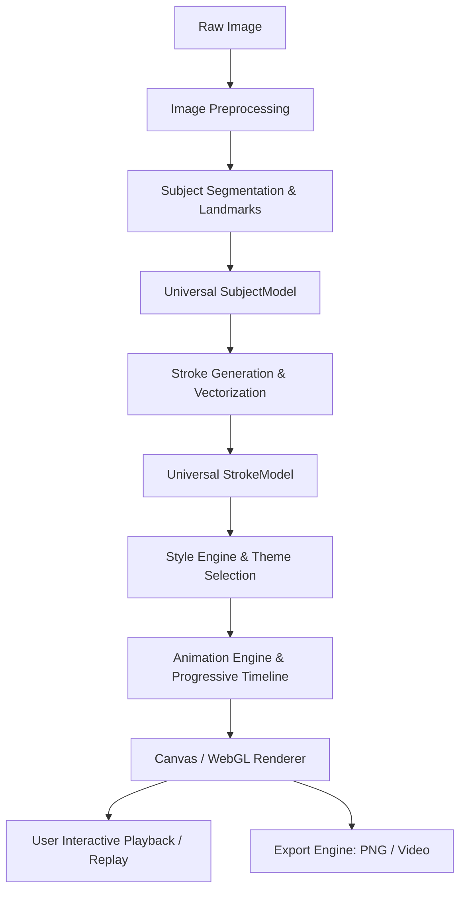

# ARCHITECTURE.md

## Repository State & Actual Architecture

> **Notice:** This document tracks the **actual implementation architecture** of the repository. It is updated continuously as code is introduced.

---

## 1. Current State of Repository
* **Status:** Phase 0 Monorepo Scaffold & Universal Data Contracts Complete.
* **Workspace Directory:** `d:/projects 2.0/main/sketch-maker`
* **File System Contents:**
  * `docs/`: Comprehensive project knowledge system (11 documents).
  * `packages/shared-types`: Universal intermediate representation contracts (`SubjectModel`, `Stroke`, `StyleConfig`, `PipelineProgress`).
  * `packages/image-processing`, `packages/structural-analysis`, `packages/stroke-engine`, `packages/style-engine`, `packages/animation-engine`, `packages/export-engine`: Initialized engine package structures with typecheck scripts.
  * `apps/web`: React 18 + Vite + TypeScript client with dark-mode aesthetic design tokens and alias links to engine packages.
* **Build System:** npm workspaces configured in root `package.json`, TypeScript 5.4+ project reference base via `tsconfig.base.json`.
* **Git Status:** Initialized git repository with comprehensive `.gitignore`. Initial commit `058e8fc`.

---

## 2. Target System Architecture (Blueprint from Project Spec)

The system is architected as an engine-first, multi-package monorepo to guarantee clean separation between algorithms and user interface.

```
photo-to-art (sketch-maker)/
│
├── apps/
│   ├── web/                     # Web Application (React + Vite + TypeScript, Canvas/WebGL)
│   └── mobile/                  # Future React Native App (Phase 11+)
│
├── packages/
│   ├── image-processing/        # Platform-agnostic image transformations, normalization, luminance
│   ├── structural-analysis/    # Platform-agnostic segmentation, landmarks, edge flow analysis
│   ├── stroke-engine/           # Platform-agnostic vector extraction, curve simplification, weighting
│   ├── style-engine/            # Platform-agnostic style generators (Cinematic, Sketch, Neon, etc.)
│   ├── animation-engine/        # Platform-agnostic progressive drawing timeline & math
│   ├── export-engine/           # Headless export encoders & rasterizers
│   └── shared-types/            # Universal models (SubjectModel, Stroke, StyleConfig, etc.)
│
├── tests/
│   ├── images/                  # Standard benchmark image test set
│   ├── structural/              # Unit tests for segmentation & landmark extraction
│   ├── strokes/                 # Unit tests for stroke generation & simplification
│   ├── rendering/               # Visual regression & canvas draw tests
│   └── performance/             # Latency & memory benchmarking scripts
│
└── docs/                        # Persistent project memory system
```

---

## 3. Universal Intermediate Representation (Data Contracts)

The architectural bridge between the deep image analysis phase and the creative rendering phase is the **Universal Intermediate Representation**. This enables caching: analyze once, render in any style repeatedly.

### 3.1 SubjectModel (Universal Structural Representation)
```typescript
export interface Point2D {
  x: number; // Normalized [0, 1] coordinate
  y: number; // Normalized [0, 1] coordinate
}

export interface ContourPath {
  id: string;
  points: Point2D[];
  closed: boolean;
  confidence: number;
}

export interface FacialFeatures {
  leftEye: ContourPath[];
  rightEye: ContourPath[];
  eyebrows: ContourPath[];
  nose: ContourPath[];
  mouth: ContourPath[];
  jawline: ContourPath[];
  ears: ContourPath[];
}

export interface BodyFeatures {
  shoulders: ContourPath[];
  arms: ContourPath[];
  torso: ContourPath[];
  legs: ContourPath[];
  poseConfidence: number;
}

export interface SubjectModel {
  version: string;
  imageDimensions: { width: number; height: number };
  silhouette: ContourPath[];
  subjectMask?: ImageData | Uint8Array; // Alpha mask of foreground subject
  face?: FacialFeatures;
  hair?: ContourPath[];
  body?: BodyFeatures;
  clothing?: ContourPath[];
  accessories?: ContourPath[];
  globalConfidence: number;
  timestamp: number;
}
```

### 3.2 Stroke & StrokeModel
```typescript
export type SemanticRegion = 
  | 'eyes'
  | 'eyebrows'
  | 'nose'
  | 'mouth'
  | 'face_contour'
  | 'hair_boundary'
  | 'body_outline'
  | 'clothing'
  | 'texture'
  | 'background'
  | 'highlight';

export interface StrokePoint extends Point2D {
  pressure?: number;
  widthMultiplier?: number;
}

export interface Stroke {
  id: string;
  startPoint: StrokePoint;
  endPoint: StrokePoint;
  controlPoints: StrokePoint[]; // Quadratic or Cubic Bézier points, or polyline points
  region: SemanticRegion;
  importance: number;           // Normalized [0.0 - 1.0] (e.g. Eyes: 1.0, Texture: 0.25)
  length: number;               // Geometric length in canvas units
  order: number;                // Sequence index in progressive drawing timeline
  styleMetadata?: Record<string, unknown>;
}

export interface StrokeModel {
  subjectModelId: string;
  strokes: Stroke[];
  totalStrokes: number;
  totalLength: number;
  drawingOrder: number[]; // Ordered array of stroke indices
}
```

---

## 4. End-to-End Processing Pipeline



### Stage Responsibilities:
1. **Image Preprocessing:** Aspect ratio handling, color normalization, contrast equalization, resizing to target processing resolution based on profile (`FAST`, `BALANCED`, `HIGH`).
2. **Subject Segmentation & Landmarks:** Foreground extraction, suppression of messy backgrounds, landmark extraction for facial and bodily features.
3. **Universal SubjectModel:** Headless structural tree containing weighted contours.
4. **Stroke Engine:** Converts contours into simplified, smooth vector paths with semantic importance tags.
5. **Universal StrokeModel:** Cached stroke geometry ready for styling.
6. **Style Engine:** Applies artistic shaders/brushes (Cinematic, Sketch, Neon, Blueprint, Binary, Terminal, Red Line).
7. **Animation Engine:** Controls drawing progression, reveal timing, particle/glow transitions, and easing curves.
8. **Rendering:** Dual mode (Interactive Canvas 2D / WebGL for real-time progressive playback; high-res headless offscreen canvas for final output).
9. **Export:** Encodes raster frames into WebM/MP4 video or high-res lossless PNG.

---

## 5. Technology Stack Selection Criteria

| Layer | Initial Technology | Rationale |
| :--- | :--- | :--- |
| **Monorepo / Workspace** | npm / pnpm workspaces | Native node workspace support, zero bloat, isolates packages |
| **Web UI** | React + Vite + TypeScript | Lightning-fast HMR, clean client-side Canvas rendering, optimal Vercel static deployment, zero SSR complexity |
| **Core Processing** | Pure TypeScript / WebAssembly where needed | Maximum platform portability (Web + React Native) |
| **Rendering** | HTML5 Canvas 2D / WebGL | Hardware accelerated, zero external runtime dependency, universal support |
| **Styling** | Vanilla CSS / CSS Modules | Clean design system tokens, optimal performance, zero CSS-in-JS overhead |
| **Testing** | Vitest + Playwright | Rapid headless unit testing for geometry + visual browser tests |

---

---

## 6. Development & Verification Environment
* **Platform:** Windows 10/11 x64, Node.js runtime, PowerShell terminal.
* **Target Host:** Vercel serverless / static asset hosting.

---

## 7. Vision Provider Architecture (TASK-103.6)

Following the evaluation in `docs/VISION_BACKEND_EVALUATION.md` and `ADR-010`, perception is abstracted through a decoupled provider boundary. Downstream procedural art engines depend strictly on the Universal Intermediate Representation (`SubjectModel`) and never communicate directly with computer vision algorithms or neural network libraries.

### 7.1 Architectural Overview

```text
                    INPUT IMAGE (NormalizedImage)
                                 │
                                 ▼
                         VisionCoordinator
                                 │
              ┌──────────────────┴──────────────────┐
              │                                     │
              ▼                                     ▼
   DeterministicVisionProvider             MediaPipeVisionProvider
   (Pure TypeScript, 0-dep)                (Optional ML runtime)
              │                                     │
              └──────────────────┬──────────────────┘
                                 ▼
                     Evidence-Aware Reconciliation
                     (Hybrid Merge / Fallback)
                                 │
                                 ▼
                           VisionResult
                                 │
                     ┌───────────┴───────────┐
                     ▼                       ▼
               SubjectModel          VisionExecutionPlan
                     │                 (Audit & Metadata)
                     ▼
          Procedural Art Engine
          (Stroke & Style Pipelines)
```

### 7.2 Core Contracts (`packages/structural-analysis/src/providers/types.ts`)

* **`VisionProvider`**: Minimal asynchronous perception contract:
  ```typescript
  export interface VisionProvider {
    readonly metadata: VisionProviderMetadata;
    isAvailable(): boolean;
    analyze(input: VisionInput): Promise<VisionResult>;
  }
  ```
* **`VisionInput`**: Preprocessed image luminance buffer (`NormalizedImage`), original image dimensions, and optional execution options.
* **`VisionResult`**: Contains `primarySubject: SubjectModel`, `allSubjects: SubjectModel[]`, `scale`, processing `metrics` (latencies, counts), provider `metadata`, and an execution audit trail `plan`.
* **`VisionCoordinator`**: High-level orchestrator supporting execution modes:
  * `'deterministic'`: Guarantees 100% pure TypeScript execution with zero external network requests.
  * `'ml'`: Uses pretrained ML models (throws structured error if unavailable).
  * `'auto'`: Attempts ML acceleration; falls back automatically and seamlessly to deterministic execution if ML is unavailable or fails.
  * `'hybrid'`: Concurrently executes both pipelines and merges dense ML facial landmarks with deterministic ear pinna geometry and silhouette-anchored hair contours.

### 7.3 Evidence-Aware Hybrid Reconciliation

Pretrained neural networks (like MediaPipe FaceLandmarker) provide dense 468-point meshes but lack external ear pinna geometry and produce over-smoothed silhouette hair boundaries. The hybrid merge layer enforces the following reconciliation rules:
1. **Internal Facial Features:** Dense eye contours, lip contours, and nasal landmarks are accepted from the ML provider when confidence exceeds 0.50.
2. **Ear Pinna Preservation:** External helix and lobule contours from `DeterministicVisionProvider` are strictly preserved into the final `SubjectModel`, preventing ear omission in art rendering.
3. **Silhouette & Hair Contours:** Gradient edge-aligned hair and silhouette paths from deterministic analysis are preserved alongside ML facial landmarks.
4. **Visibility Semantics:** Occlusion classifications (`'occluded'`, `'uncertain'`, `'visible'`, `'not_detected'`) are strictly preserved across both backends.

### 7.4 Web vs. Mobile Separation

* **Platform Neutrality:** Core packages (`@sketch-maker/structural-analysis`, `@sketch-maker/shared-types`) contain no browser-only (`window`, `document`) or Node-only APIs.
* **Web Runtime:** In the web client (`apps/web`), `MediaPipeVisionProvider` is instantiated with `MediaPipeWebDelegate` from `apps/web/src/vision/mediapipe/`.
* **Mobile Runtime:** In a future React Native client (`apps/mobile`), the same provider interface accepts native iOS/Android bridge delegates.
* **Headless CI / Testing:** Automated test suites run in pure Node.js using `DeterministicVisionProvider` without WebGL or canvas polyfills.

### 7.5 MediaPipe Face Landmarker Web Integration (TASK-103.7)

* **Isolated Bundle Chunk:** MediaPipe tasks are isolated in a lazy-loaded Vite chunk (`vision_bundle-*.js`), keeping the initial application bundle lightweight (~239 kB).
* **478-Landmark Mapping:** Maps dense 3D points to canonical `SubjectModel` features (iris centers, palpebral fissures, nasal apex, lips, mandibular contour) while clamping all normalized coordinates to `[0.0, 1.0]`.
* **Profile Occlusion Enforcement (`BM-02`):** MediaPipe's complete face projections are audited against derived head pose; features on the hidden side of true profiles are tagged `'occluded'` with 0 confidence to prevent hallucination.
* **Zero Ear Fabrication:** MediaPipe's lack of pinna geometry is respected; ears are left undefined or sourced authoritatively from the deterministic pipeline via the `reconcileHybridSubjects` reconciler.


